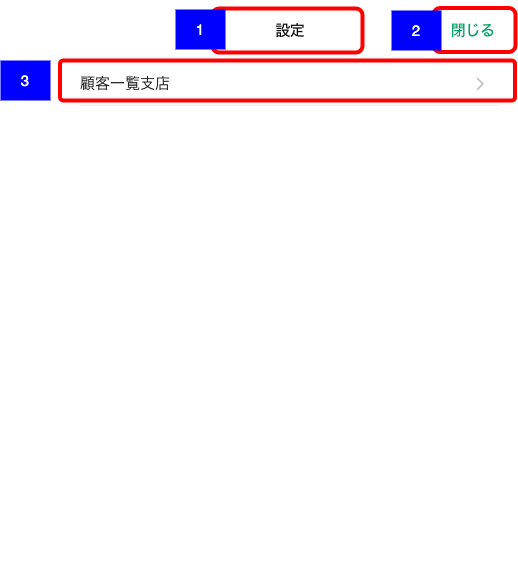

# アプリ設定トップ

## 概要

アプリ全般に関する設定を実施する画面

## 画面遷移

N/A

## 画面レイアウト

- アプリ設定トップ

## 画面項目

1. タイトル
    - [X] 「設定」が表示される。
2. 閉じる
    - [X] タップすると[閉じるボタンをタップ](閉じるボタンをタップ)を実行する。
3. 顧客一覧支店
    - [X] 「顧客一覧支店」と右端にシェブロンが表示される。
    - [X] タップすると[顧客一覧支店をタップ](顧客一覧支店をタップ)を実行する。

## イベント

この項では、当画面にて実行されるイベント一覧を記述する。

### 閉じるボタンをタップ

- [X] 当画面を閉じ、コンテキストメニューの遷移元の画面に戻る。

### 顧客一覧支店をタップ

- [X] 顧客一覧支店画面に遷移する。
