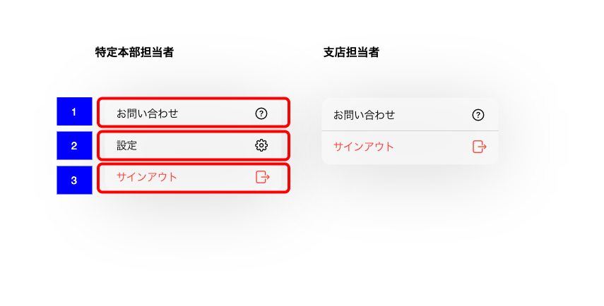

# 設定コンテキストメニュー

## 概要

タスク一覧画面もしくは顧客一覧画面の右上の歯車アイコンをタップすると表示されるアプリ全般に関する設定やサインアウトを含むメニューを表示する。

## 画面遷移

N/A

## 画面レイアウト

- 設定コンテキストメニュー

## 画面項目

1. お問い合わせ
    - [X] 「お問い合わせ」とクエスチョンマークのアイコンが表示される。
    - [X] タップすると[お問い合わせをタップ](お問い合わせをタップ)を実行する。
2. 設定
    - [X] 特定の本部所属の担当者のみ表示される。  
    ※特定本部は以下を参照  
    [【RB】所属以外支店の顧客一覧の閲覧を設定できる部店番号の決定](https://devplf.resonabank.co.jp/resonaso/issues/21252)  
    [【SR】所属以外支店の顧客一覧の閲覧を設定できる部店番号の決定](https://devplf.resonabank.co.jp/resonaso/issues/21253)
    - [X] 支店担当者の場合表示されない。
    - [X] 「設定」と歯車のアイコンが表示される。
    - [X] タップすると[設定をタップ](設定をタップ)を実行する。
3. サインアウト
    - [X] 「サインアウト」と赤字で表示される。
    - [X] タップすると[サインアウトをタップ](サインアウトをタップ)を実行する。

## イベント

この項では、当画面にて実行されるイベント一覧を記述する。

### お問い合わせをタップ

- [ ] お問い合わせ画面がモーダル表示される。

### 設定をタップ

- [ ] アプリ設定画面がモーダル表示される。

### サインアウトをタップ

- [ ] アプリを初期化してUSO認証画面が表示される。
