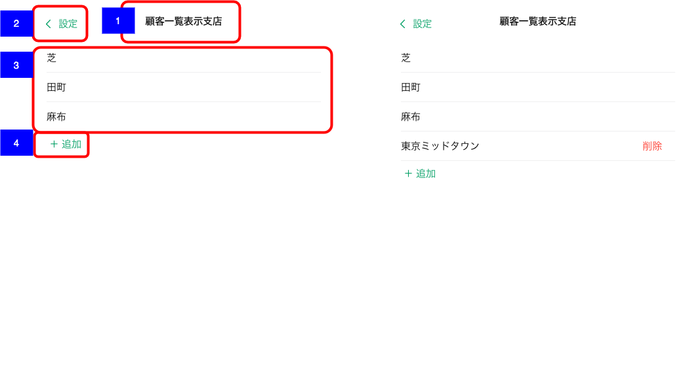

# 顧客一覧表示支店

## 概要

顧客一覧画面に表示する支店を検索・選択する画面

## 画面遷移

N/A

## 画面レイアウト

- 顧客一覧表示支店

## 画面項目

1. タイトル
    - [X] 「顧客一覧表示支店」が表示される。
2. 戻るボタン
    - [X] 「< 設定」が表示される。
    - [X] タップすると[戻るボタンをタップ](戻るボタンをタップ)を実行する。
3. 支店一覧
    - [ ] （N/A. エリア所属の営業店は当画面は表示されない）エリア所属の場合、エリアの支店一覧と当画面から追加した支店の一覧が表示される。
    - [X] エリア所属でない場合、所属支店と当画面から追加した支店の一覧が表示される。
    - [X] 当画面から追加した支店の右端に赤字で削除ボタンが表示される。
    - [X] エリアの支店もしくは所属支店には削除ボタンは表示されない。
    - [X] 削除ボタンタップすると[削除ボタンをタップ](削除ボタンをタップ)を実行する。
4. 追加ボタン
    - [X] 一覧の最後に「+ 追加」ボタンが表示される。
    - [X] タップすると[追加ボタンをタップ](追加ボタンをタップ)を実行する。

## イベント

この項では、当画面にて実行されるイベント一覧を記述する。

### 戻るボタンをタップ

- [X] 遷移元の画面に戻る。

### 削除ボタンをタップ

- [X] 該当の支店を削除し一覧から非表示となる。
- [X] 削除後は顧客一覧画面の左パネルの支店一覧からも非表示となる。

### 追加ボタンをタップ

- [X] 顧客一覧表示支店選択画面をモーダル表示する。
