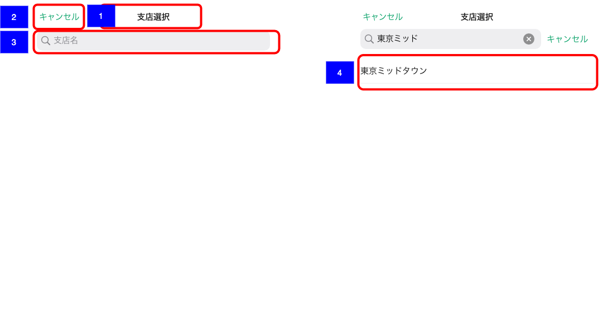

# 顧客一覧表示支店選択

## 概要

顧客一覧表示支店に追加する支店を検索・選択する画面

## 画面遷移

N/A

## 画面レイアウト

- 顧客一覧表示支店選択

## 画面項目

1. タイトル
    - [X] 「支店選択」が表示される。
2. キャンセルボタン
    - [X] 「キャンセル」が表示される。
    - [X] タップすると[キャンセルボタンをタップ](キャンセルボタンをタップ)を実行する。
3. 検索フィールド
    - [X] プレースホルダーに「支店名」が表示される。
    - [X] 文字を入力し変換が確定すると、該当する文字列が含まれる支店の結果が支店一覧に表示される。  
    ※ ひらがなで入力した場合、iOSアプリ側でカタカナに変換してAPI検索が実行される。
4. 支店一覧
    - [X] 初期状態では何も表示されない。
    - [X] 検索フィールドに文字を入力し検索実行した結果が一覧表示される。
    - [X] 支店をタップすると[支店をタップ](支店をタップ)を実行する。

## イベント

この項では、当画面にて実行されるイベント一覧を記述する。

### キャンセルボタンをタップ

- [X] 当画面を閉じ、遷移元の画面に戻る。

### 削除ボタンをタップ

- [X] 該当の支店を削除し一覧から非表示となる。
- [X] 削除後は顧客一覧画面に左パネルの支店一覧からも非表示となる。

### 支店をタップ

- [X] タップした支店が既に顧客一覧表示支店に存在する場合、「この支店は追加できません。」というアラートが表示される。
- [X] 上記以外の場合タップした支店を顧客一覧表示支店に追加し、当画面を閉じて遷移元の画面に戻る。
- [X] 追加後は顧客一覧画面の左パネルの支店一覧にも反映される。
