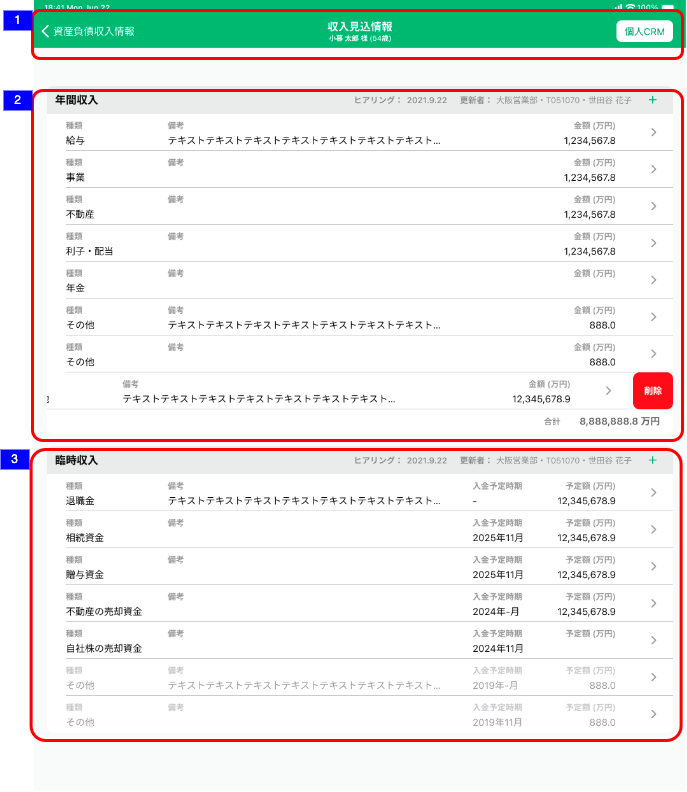

# 収入見込情報

## 概要

収入見込情報の明細を確認するための画面

## 画面遷移

N/A

## 画面レイアウト図

- 収入見込情報



## 画面項目

1. ヘッダー
    - 資産負債収入情報リンク
        - [x] タップすると、[資産負債収入情報トップ画面への遷移イベント](#資産負債収入情報トップ画面への遷移)を実行する。
    - 画面名
        - [x] "収入見込情報"を表示する。
    - 顧客情報
        - [x] 顧客詳細画面にて表示されている対象顧客の氏名と年齢を表示する。
        - [ ] 顧客詳細画面にて年齢が表示されていない場合、年齢（-歳）を表示する。
    - 個人CRMリンク
        - [x] タップすると[個人CRMへの遷移イベント](#個人CRMへの遷移)を実行する。
2. 年間収入エリア
    - ヘッダー
        - エリア名
            - [x] "年間収入"を表示する。
        - 更新情報
            - [x] 明細が存在しない場合、何も表示しない。
            - ヒアリング日
                - [x] 分類が"年間収入"の明細のうち最終更新日時が最も新しいものの、最終更新年月日を`YYYY.M.D`の形式で表示する。

            ```md
                存在するデータの中で最も大きい日付を表示するので、最も大きい日付が削除された場合、次に大きい日付が表示されることとなる。
                例: 1明細のみ登録されたデータを削除した場合、
                ①何も登録していない状態（更新日「まだヒアリングしていません」と表示される状態）
                ②1/31　1明細を登録
                ③2/1　  ②で登録した1明細を削除
                → ヒアリングには「まだヒアリングしていません」が表示される。
            ```

            - 更新者
                - [x] 分類が"年間収入"の明細のうち最終更新日時が最も新しいものの、更新者情報を`支店名・R2ID・更新者名`の形式で表示する。
                - [x] 更新者が退職済みの場合、所属店名、R2ID、更新者氏名を表示する。
                - [x] 所属店名が不明な場合、「不明な支店」を表示する。
        - 明細追加ボタン
            - [x] "＋"ボタンを表示する。
            - [x] タップすると[追加ボタン（年間収入エリア）をタップ](#追加ボタン（年間収入エリア）をタップ)を実行する。
    - 明細カード
        - [x] 明細が存在しない場合は、"ヒアリングして+ボタンから更新しましょう"が表示される。
        - [x] 明細が存在する場合は、明細が追加された順（明細ID）の昇順でソートされていること。
        - [x] 明細をタップすると[年間収入明細をタップ](#年間収入明細をタップ)を実行する。
        - 種類
            - [x] "未選択"の場合、ブランクで表示される。
            - [x] 「給与」/「事業」/「不動産」/「利子・配当」/「年金」/「その他」が表示される。
        - 備考
            - [x] 存在しない場合はブランクで表示される。
            - [x] 存在する場合は、対象の備考が表示される。
        - 金額
            - [x] 存在しない場合はブランクで表示される。
            - [x] 存在する場合は対象の金額が"万円"単位で小数点第一位まで表示される。
        - 削除ボタン
            - [x] 明細を右から左にスワイプすると出現する。
            - [x] 削除ボタンが表示された状態で明細をタップすると非表示になる。
            - [x] タップすると[削除ボタンをタップ](#削除ボタンをタップ)を実行する。
    - フッター
        - [x] 明細が存在しない場合は、フッターは表示されない。
        - [x] 各明細の金額の合計額が"万円"単位で小数点第一位まで表示される。
        - [x] 明細のうち金額が存在しないものは加算されない。
3. 臨時収入エリア
    - ヘッダー
        - エリア名
            - [x] "臨時収入"を表示する。
        - 更新情報
            - [x] 明細が存在しない場合、何も表示しない。
            - ヒアリング日
                - [x] 分類が"臨時収入"の明細のうち最終更新日時が最も新しいものの、最終更新年月日を`YYYY.M.D`の形式で表示する。

            ```md
                存在するデータの中で最も大きい日付を表示するので、最も大きい日付が削除された場合、次に大きい日付が表示されることとなる。
                例: 1明細のみ登録されたデータを削除した場合、
                ①何も登録していない状態（更新日「まだヒアリングしていません」と表示される状態）
                ②1/31　1明細を登録
                ③2/1　  ②で登録した1明細を削除
                → ヒアリングには「まだヒアリングしていません」が表示される。
            ```

            - 更新者
                - [x] 分類が"臨時収入"の明細のうち最終更新日時が最も新しいものの、更新者情報を`支店名・R2ID・更新者名`の形式で表示する。
                - [x] 更新者が退職済みの場合、所属店名、R2ID、更新者氏名を表示する。
                - [x] 所属店名が不明な場合、「不明な支店」を表示する。
        - 明細追加ボタン
            - [x] "＋"ボタンを表示する。
            - [x] タップすると[追加ボタン（臨時収入エリア）をタップ](#追加ボタン（臨時収入エリア）をタップ)を実行する。
    - 明細カード
        - [x] 明細が存在しない場合は、"ヒアリングして+ボタンから更新しましょう"が表示される。
        - [x] 明細が存在する場合は、以下の条件でソートする。
            - [x] 入金予定時期が未定の明細、未定以外の明細の順に表示する。
            ※未定の明細とは入金予定時期が存在しない、または存在するが年が不明な場合の明細を指す。（例：----年--月、----年5月）
            - [x] 入金予定時期が未定以外の明細の中では、入金予定時期の降順で並べる。月が未定の場合は、12月として判断する。
            - [x] 入金予定時期が同じ場合、明細の最終更新日の昇順で並べる。
            上記条件に従うと、以下のように明細が並ぶ。  
            例：  

                | 入出金予定時期 | 明細の最終更新日 |
                | ---- | ---- |
                |-|2021年2月|
                |2023年--月|2021年2月|
                |2023年10月|2021年2月|
                |2020年10月|2021年2月|
                |2020年10月|2021年5月|

        - [x] 入金予定時期が過去の明細については薄いグレーの文字で表示する。
        ※過去の明細とは、2022年7月22日にアプリを開いた場合、入金予定時期が2022年6月以前の年月で登録された明細を指す。
        - [x] 明細をタップすると[臨時収入明細をタップ](#臨時収入明細をタップ)を実行する。
        - 種類
            - [x] "未選択"の場合、ブランクで表示される。
            - [x] 「退職金」/「相続資金」/「贈与資金」/「不動産の売却資金」/「自社株の売却資金」/「その他」のいずれかが表示される。
        - 備考
            - [x] 存在しない場合はブランクで表示される。
            - [x] 存在する場合は、対象の備考が表示される。
        - 入金予定時期
            - [x] 存在しない場合はブランクで表示される。
            - [x] 存在する場合、年月が明瞭な場合は"YYYY年M月"が表示される。
            - [x] 存在する場合、年が不明な場合は"----年M月"が表示される。
            - [x] 存在する場合、月が不明な場合は"YYYY年--月"が表示される。
        - 予定額
            - [x] 存在しない場合はブランクで表示される。
            - [x] 存在する場合は対象の金額が"万円"単位で小数点第一位まで表示される。
        - 削除ボタン
            - [x] 明細を右から左にスワイプすると出現する。
            - [x] 削除ボタンが表示された状態で明細をタップすると非表示になる。
            - [x] タップすると[削除ボタンをタップ](#削除ボタンをタップ)を実行する。


## イベント

この項では、当画面にて実行されるイベント一覧を記述する。

### 資産負債収入情報トップ画面への遷移

- [x] 資産負債収入情報トップ画面に遷移する。

### 個人CRMへの遷移

- [x] 個人CRM（他システム）に遷移する。

### 追加ボタン（年間収入エリア）をタップ

- [x] 年間収入追加画面に遷移する。

### 年間収入明細をタップ

- [x] 年間収入編集画面に遷移する。

### 追加ボタン（臨時収入エリア）をタップ

- [x] 臨時収入追加画面に遷移する。

### 臨時収入明細をタップ

- [x] 臨時収入編集画面に遷移する。

### 削除ボタンをタップ

- [x] ポップアップメッセージ「(タイトル)明細を削除します。(本文)この操作は取り消すことができません。(キャンセル/削除)」が表示される。
- [x] ポップアップメッセージに対して、削除をタップすると 該当の明細が削除され、該当分類の合計金額を集計、表示する。
- [x] ポップアップメッセージに対して、キャンセルをタップすると当画面(編集モード)に戻る。
