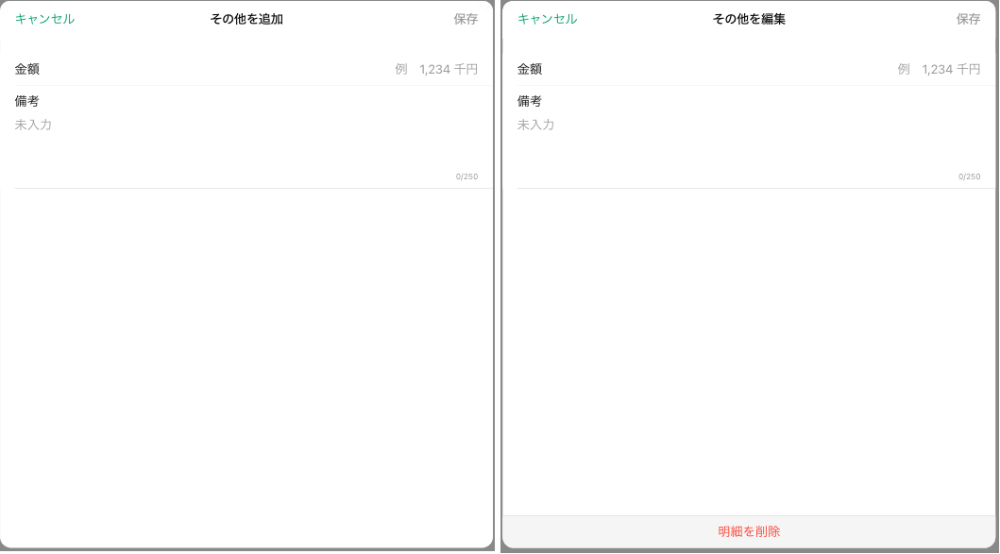

# 明細追加・編集ダイアログ（その他固定資産-その他）

## 概要

資産負債情報明細一覧（その他固定資産）のその他エリアの明細上でのタップイベントにより表示する。
以下の操作ができる。

- 資産負債情報明細一覧（その他固定資産-その他）の登録・更新・削除

## 画面遷移

N/A

## 画面レイアウト図

- 明細追加・編集ダイアログ（その他固定資産-その他）

## 画面項目

明細追加・編集ダイアログ（その他固定資産-その他）には、以下の情報を上から順に表示する。

1. 画面名
    - [x] 追加操作で表示した場合は、"その他を追加" と表示する。
    - [x] 編集操作で表示した場合は、"その他を編集" と表示する。
2. 保存ボタン
    - [x] いずれの項目に値が入っていない場合、非活性になる。何らかの値が入っている場合、活性になる。
    - [x] タップすると、[保存ボタンをタップ](#保存ボタンをタップ)を実行する。
3. キャンセルボタン
    - [x] タップすると、[キャンセルボタンをタップ](#キャンセルボタンをタップ)を実行する。
4. 金額
    - [x] 編集操作で表示した場合、タップした明細の登録情報をセットする。登録情報が存在しない場合、placeholderに「例 1,234 万円」を表示する。
    - [x] 追加操作で表示した場合、placeholderに「例 1,234 万円」を表示する。
    - [x] 入力方法が数字の自由入力である。
    - [x] プラス整数、7桁まで入力できる。3桁区切りのカンマが自動付与される。
    - [x] 数字を入力した場合、単位は万円で表示される。
    - [x] 小数第一位まで入力できる。小数第二位以降の入力は抑止され、入力が反映しない。
    - [x] 小数第一位の値が無い（0）場合は、整数表示される。
    - [x] 小数第一位の値がある（1-9）場合は、小数表示される。
    - [x] マイナスの入力が抑止され、入力が反応しない。
5. 備考
    - [x] 編集操作で表示した場合、タップした明細の登録情報をセットする。登録情報が存在しない場合、placeholderに「未入力」「0/250」を表示する。
    - [x] 追加操作で表示した場合、placeholderに「未入力」「0/250」を表示する。
    - [x] 項目をタップした場合、キーボードが出現する。
    - [x] 入力方法が自由入力である。
    - [x] 入力可能文字が250文字である。
    - [x] 現在入力している文字数を表示する。
    - [x] ×をタップすると入力内容を削除する。
    - [x] 改行を繰り返すなどで、初期表示枠外に入力が及んだ場合でも入力領域がスクロール表示され入力内容が視認できる。
6. 明細を削除ボタン
    - [x] 追加操作で表示した場合、表示しない。
    - [x] 編集操作で表示した場合、表示する。
    - [x] タップすると、[明細を削除ボタンをタップ](#明細を削除ボタンをタップ)を実行する。

## イベント

この項では、当画面にて実行されるイベント一覧を記述する。

### 資産負債情報明細一覧画面の表示

- [x] 当画面を閉じ、[資産負債情報明細一覧（その他固定資産）画面](資産負債情報明細一覧（その他固定資産）.md)を表示する。

#### 保存ボタンをタップ

- [x] 資産負債情報の取得後に対象の顧客の資産負債情報が削除された場合、エラーメッセージを表示する。
- [x] 編集操作で表示した場合、更新処理を行う。
  - [x] 登録が完了した旨のトーストを表示する。
  - [x] 当画面を閉じ、登録内容を反映して資産負債情報明細一覧（その他固定資産）を表示する。
  - [x] 資産負債情報明細一覧（その他固定固定）画面は、追加した順で明細を表示する仕様のため、更新された明細の表示順序に変更はない。
  - [x] その他エリアのヒアリング情報が更新される。
- [x] 追加操作で表示した場合、登録処理を行う。
  - [x] 登録が完了した旨のトーストを表示する。
  - [x] 当画面を閉じ、登録内容を反映して資産負債情報明細一覧（その他固定資産）を表示する。
  - [x] 資産負債情報明細一覧（その他固定資産）画面は、追加した順で明細を表示する仕様のため、追加された明細は同一科目分類の最後行に表示される。
  - [x] その他エリアのヒアリング情報が更新される。

#### 明細を削除ボタンをタップ

- [x] 資産負債情報の取得後に対象の顧客の資産負債情報が削除された場合、エラーメッセージを表示する。
- [x] 削除ポップアップを表示する。
  - [x] 削除をタップした場合、削除処理を実行する。
    - [x] 当画面を閉じ、登録内容を反映して資産負債情報明細一覧（その他固定資産）を編集モードで表示する。
    - [x] その他エリアのヒアリング情報が更新される。（削除した明細を除いて一番新しい明細のヒアリング情報が表示される）
  - [x] キャンセルボタンをタップした場合、削除処理を実行せずにポップアップを閉じ、当画面を表示する。

#### キャンセルボタンをタップ

- [x] 編集操作で表示した場合、以下を実行する。
  - [x] 変更がない場合は、当画面を閉じ、資産負債情報明細一覧（その他固定資産）を編集モードで表示する。
  - [x] 変更がある場合は、確認ダイアログを表示する。
    - [x] 確認ダイアログでキャンセルを選択すると、当画面に戻る。
    - [x] 確認ダイアログで破棄を選択すると、当画面を閉じ、資産負債情報明細一覧（その他固定資産）を編集モードで表示する。
- [x] 追加操作で表示した場合、以下を実行する。
  - [x] 入力がない場合は、当画面を閉じ、資産負債情報明細一覧（その他固定資産）を表示する。
  - [x] 入力がある場合は、確認ダイアログを表示する。
    - [x] 確認ダイアログでキャンセルを選択すると、当画面に戻る。
    - [x] 確認ダイアログで破棄を選択すると、当画面を閉じ、資産負債情報明細一覧（その他固定資産）を表示する。
- [x] 入力内容を破棄し、登録、更新を行わない。
