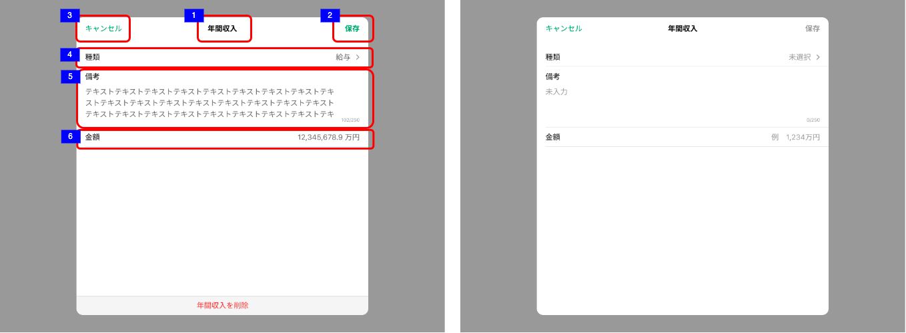

# 明細追加・編集ダイアログ（年間収入）

## 概要

収入見込情報一覧の年間収入エリアの明細上でのタップイベントにより表示する。
以下の操作ができる。

- 収入見込情報一覧（年間収入）の登録・更新・削除

## 画面遷移

N/A

## 画面レイアウト図

- 明細追加・編集ダイアログ（年間収入）

## 画面項目

明細追加・編集ダイアログ（年間収入）には、以下の情報を上から順に表示する。

1. 画面名
    - [x] "年間収入" と表示する。
2. 保存ボタン
    - [x] いずれの項目に値が入っていない場合、非活性になる。何らかの値が入っている場合、活性になる。
    - [x] タップすると、[保存ボタンをタップ](#保存ボタンをタップ)を実行する。
3. キャンセルボタン
    - [x] タップすると、[キャンセルボタンをタップ](#キャンセルボタンをタップ)を実行する。
4. 種類
    - [x] 編集操作で表示した場合、タップした明細の登録情報をセットする。
    - [x] 追加操作で表示した場合、placeholderに「未選択」を表示する。
    - [x] 項目をタップした場合、「未選択」/「給与」/「事業」/「不動産」/「利子・配当」/「年金」/「その他」の選択項目を表示する。
    - [x] 値が入力されている場合、入力されている値が選択された状態で選択項目を表示する。
5. 備考
    - [x] 編集操作で表示した場合、タップした明細の登録情報をセットする。登録情報が存在しない場合、placeholderに「未入力」「0/250」を表示する。
    - [x] 追加操作で表示した場合、placeholderに「未入力」「0/250」を表示する。
    - [x] 項目をタップした場合、キーボードが出現する。
    - [x] 入力方法が自由入力である。
    - [x] 入力可能文字が250文字である。
    - [x] 現在入力している文字数を表示する。
    - [x] ×をタップすると入力内容を削除する。
    - [x] 改行を繰り返するなどで、初期表示枠外に入力が及んだ場合でも入力領域がスクロール表示され入力内容が視認できる。
6. 金額
    - [x] 編集操作で表示した場合、タップした明細の登録情報をセットする。登録情報が存在しない場合、placeholderに「例 1,234 万円」を表示する。
    - [x] 追加操作で表示した場合、placeholderに「例 1,234 万円」を表示する。
    - [x] 入力方法が数字の自由入力である。
    - [x] プラス整数、7桁まで入力できる。3桁区切りのカンマが自動付与される。
    - [x] 小数第一位まで入力できる。小数第二位以降の入力は抑止され、入力が反映しない。
    - [x] マイナスの入力が抑止され、入力が反応しない。
7. 明細を削除ボタン
    - [x] 追加操作で表示した場合、表示しない。
    - [x] 編集操作で表示した場合、表示する。
    - [x] タップすると、[明細を削除ボタンをタップ](#明細を削除ボタンをタップ)を実行する。

## イベント

この項では、当画面にて実行されるイベント一覧を記述する。

### 保存ボタンをタップ

- [x] 編集操作で表示した場合、更新処理を行う。
  - [x] 保存が完了した旨のトーストを表示する。
  - [x] 当画面を閉じ、登録内容を反映して収入見込情報一覧を表示する。
  - [x] 年間収入エリアのヒアリング情報が更新される。
- [x] 追加操作で表示した場合、登録処理を行う。
  - [x] 保存が完了した旨のトーストを表示する。
  - [x] 当画面を閉じ、登録内容を反映して収入見込情報一覧を表示する。
  - [x] 年間収入エリアのヒアリング情報が更新される。

### 明細を削除ボタンをタップ

- [x] 削除ポップアップを表示する。
  - [x] 削除をタップした場合、削除処理を実行する。
    - [x] 当画面を閉じ、登録内容を反映して収入見込情報一覧を表示する。
    - [x] 年間収入年間エリアのヒアリング情報が更新される。（削除した明細を除いて一番新しい明細のヒアリング情報が表示される）
  - [x] キャンセルボタンをタップした場合、削除処理を実行せずにポップアップを閉じ、当画面を表示する。

### キャンセルボタンをタップ

- [x] 編集操作で表示した場合、以下を実行する。
  - [x] 変更がない場合は、当画面を閉じ、収入見込情報一覧を表示する。
  - [x] 変更がある場合は、確認ダイアログを表示する。
    - [x] 確認ダイアログでキャンセルを選択すると、当画面に戻る。
    - [x] 確認ダイアログで破棄を選択すると、当画面を閉じ、収入見込情報一覧を表示する。
- [x] 追加操作で表示した場合、以下を実行する。
  - [x] 入力がない場合は、当画面を閉じ、収入見込情報一覧を表示する。
  - [x] 入力がある場合は、確認ダイアログを表示する。
    - [x] 確認ダイアログでキャンセルを選択すると、当画面に戻る。
    - [x] 確認ダイアログで破棄を選択すると、当画面を閉じ、収入見込情報一覧を表示する。
- [x] 入力内容を破棄し、登録、更新を行わない。
