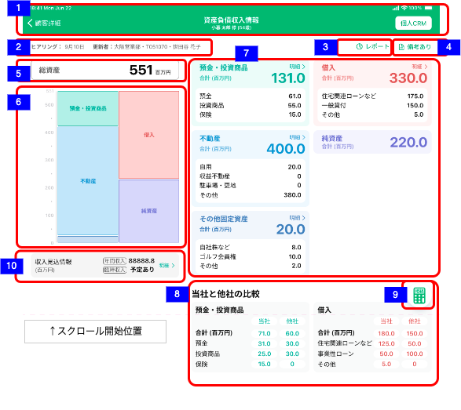

# 資産負債収入情報トップ

## 概要

CRMから取得した資産情報とヒアリングした負債情報の全体像を俯瞰するための画面

## 画面遷移

N/A

## 画面レイアウト図

- 情報トップ  


## 画面項目

 :point_up: 麻布支店ユーザーでログインし、顧客「No.1」の顧客詳細画面.資産負債カードをタップすることで確認できる。顧客Noは、data/データ(資産負債収入情報トップ).xlsxを参照。
> 上記顧客で確認できない項目については、都度注釈にて顧客を指定する。

1. ヘッダー
    - 顧客詳細リンク
        - [x] タップすると、[顧客詳細画面への遷移イベント](#顧客詳細画面への遷移)を実行する。
    - 画面名
        - [x] 「資産負債収入情報」を表示する。
    - 顧客情報
        - [x] 顧客詳細画面にて表示されている対象顧客の氏名と年齢を表示する。
        - [x] 顧客詳細画面にて年齢が表示されていない場合、年齢（-歳）を表示する。
    - 個人CRMリンク
        - [x] タップすると[個人CRMへの遷移イベント](#個人CRMへの遷移)を実行する。個人CRMの該当CIFのトップ画面に遷移する
2. ヒアリング・更新者
    - [x] ヒアリングを年内に行った場合、 `M月d日` の形式で更新日を表示する。
    - [x] 更新日は登録明細ごとの更新日付及び備考更新日付のうち最も大きい日付を表示する。
    - [x] 最大更新日時を有する明細を削除した場合、残りの登録明細のうち最も大きい日付が表示されることになる。

    ```md
        存在するデータの中で最も大きい日付を表示するので、最も大きい日付が削除された場合、次に大きい日付が表示されることとなる。
        例: 1明細のみ登録されたデータを削除した場合、
        ①何も登録していない状態（更新日「まだヒアリングしていません」と表示される状態）
        ②1/31　1明細を登録
        ③2/1　  ②で登録した1明細を削除
        → ヒアリングには「まだヒアリングしていません」が表示される。
    ```

    - [x] ヒアリングを去年より過去に行った場合、 `yyyy年M月d日` の形式で更新日を表示する。　 :point_left: 顧客「No.2」で確認できる。
    - [x] ヒアリングを行った場合、更新者の所属店名、R2ID、更新者氏名を表示する。
        - [x] 更新者が退職済みの場合、所属店名、R2ID、更新者氏名を表示する。　 :point_left: 顧客「No.2」で確認できる。
        - [x] 所属店名が不明な場合、「不明な支店」を表示する。　 :point_left: 「No.3」
    - [x] ヒアリングが行われていない場合、「まだヒアリングしていません」を表示する。【イレギュラー3】　 :point_left: 顧客「No.4」で確認できる。
3. レポートボタン
    - 2022年4月時点未実装。
4. 備考ありボタン
    - 2022年4月時点未実装。
5. 総資産
    - [x] 総資産の金額を表示する。総資産の金額＝資産合計。資産合計＝預金・投資商品＋不動産＋その他固定資産科目ごとの金額。
    - [x] 金額は5桁まで、整数値で表示する。　 :point_left: 顧客「No.5」で確認できる。
    - [x] 各項目共通: 百万円未満の表示仕様
        - [x] 0.1百万円未満の場合、「< 0.1」と表示する。　 :point_left: 顧客「No.3」で確認できる。
        - [x] 1百万円-10百万未満の場合、小数第一位（十万円単位）まで表示する。小数第二位（一万円単位）は切り捨て。　 :point_left: 顧客「No.8 ~ 12」で確認できる。
        - [x] 10百万円以上の場合、整数（百万円単位）まで表示する。小数第一位（十万円単位）は切り捨て。　 :point_left: 顧客「No.13」で確認できる。
    - [x] 金額の数字が表示範囲内に収まらない場合、縮小で表示する。　 :point_left: 顧客「No.6」で確認できる。
6. バランスシート
    - [x] 左側：預金・投資商品、不動産、その他固定資産を表示する。右側：借入、純資産を表示する。
    - [x] 総資産に応じて目盛を刻む単位を決定する
        - [x] 0.1—1.0百万円: 0.1単位　 :point_left: 顧客「No.7」で確認できる。
        - [x] 1.1—2.0百万円: 0.2単位　 :point_left: 顧客「No.8」で確認できる。
        - [x] 2.1—10百万円: 1.0単位　 :point_left: 顧客「No.9」で確認できる。
        - [x] 11—20百万円: 2単位　 :point_left: 顧客「No.10」で確認できる。
        - [x] 21—100百万円: 10単位　 :point_left: 顧客「No.11」で確認できる。
        - [x] 101—200百万円: 20単位　 :point_left: 顧客「No.12」で確認できる。
        - [x] 201—1,000百万円: 100単位　 :point_left: 顧客「No.13」で確認できる。
        - [x] 1,001—2,000百万円: 200単位　 :point_left: 顧客「No.14」で確認できる。
        - [x] 2,001—10,000百万円: 1,000単位　 :point_left: 顧客「No.15」で確認できる。
        - [x] 10,001—20,000百万円: 2,000単位　 :point_left: 顧客「No.16」で確認できる。
        - [x] 20,001—100,000百万円: 10,000単位　 :point_left: 顧客「No.17」で確認できる。
    - バランスシート表示パターン
        - 純資産がマイナスの場合は左側に表示する。【イレギュラー1】
            - [x] 資産より借入が大きい
                - [x] 借入のみ　 :point_left: 顧客「No.10」で確認できる。
                - [x] 借入+資産　 :point_left: 顧客「No.15」で確認できる。
            - [x] 資産より預金・投資商品マイナスが大きい
                - [x] 預金・投資商品マイナスのみ　 :point_left: 顧客「No.21」で確認できる。
                - [x] 預金・投資商品マイナス+資産　 :point_left: 顧客「No.22」で確認できる。
            - [x] 資産より「借入と預金・投資商品マイナス」が大きい
                - [x] 借入と預金・投資商品マイナスのみ　 :point_left: 顧客「No.24」で確認できる。
                - [x] 「借入と預金・投資商品マイナス」+資産　 :point_left: 顧客「No.26」で確認できる。
        - [x] 預金・投資商品がマイナスの場合は右側に表示する。【イレギュラー2】　 :point_left: 顧客「No.21」で確認できる。
        - [x] 何も値が入っていない状態（りそな資産が無く、何もヒアリングできていない状態）では、バランスシートグラフに「表示できる資産負債情報がありません」の文言を表示する。【イレギュラー4】　 :point_left: 顧客「No.4」で確認できる。
        - [x] 総資産額が0.1百万円未満の場合、バランスシートグラフに「総資産が0.1百万以上だと表示されます」の文言を表示する。【イレギュラー5】　 :point_left: 顧客「No.3」で確認できる。
        - [x] 各科目の面積が小さい(23pt未満)場合は、科目名を非表示にする。　 :point_left: 顧客「No.11」で確認できる。
        - 科目分類が純資産＋1つ
            - [x] 預金・投資商品（金額プラス）のみ　 :point_left: 顧客「No.7」で確認できる。
            - [x] 預金・投資商品（金額マイナス）のみ　 :point_left: 顧客「No.21」で確認できる。
            - [x] 不動産のみ　 :point_left: 顧客「No.8」で確認できる。
            - [x] その他固定資産のみ　 :point_left: 顧客「No.9」で確認できる。
            - [x] 借入のみ　 :point_left: 顧客「No.10」で確認できる。
        - 科目分類が純資産＋2つ
            - [x] 預金・投資商（金額プラス）と不動産　 :point_left: 顧客「No.11」で確認できる。
            - [x] 預金・投資商（金額マイナス）と不動産　 :point_left: 顧客「No.22」で確認できる。
            - [x] 預金・投資商品（金額プラス）とその他固定資産　 :point_left: 顧客「No.12」で確認できる。
            - [x] 預金・投資商品（金額マイナス）とその他固定資産　 :point_left: 顧客「No.23」で確認できる。
            - [x] 預金・投資商品（金額プラス）と借入　 :point_left: 顧客「No.13」で確認できる。
            - [x] 預金・投資商品（金額マイナス）と借入　 :point_left: 顧客「No.24」で確認できる。
            - [x] 不動産とその他固定資産　 :point_left: 顧客「No.14」で確認できる。 -> メモ: 700-1003007にその他固定資産を追加して確認
            - [x] 不動産と借入　 :point_left: 顧客「No.15」で確認できる。
            - [x] その他固定資産と借入　 :point_left: 顧客「No.16」で確認できる。
        - 科目分類が純資産＋3つ
            - [x] 預金・投資商品（金額プラス）/不動産/その他固定資産　 :point_left: 顧客「No.17」で確認できる。
            - [x] 預金・投資商品（金額マイナス）/不動産/その他固定資産　 :point_left: 顧客「No.25」で確認できる。
            - [x] 預金・投資商品（金額プラス）/不動産/借入　 :point_left: 顧客「No.18」で確認できる。
            - [x] 預金・投資商品（金額マイナス）/不動産/借入　 :point_left: 顧客「No.26」で確認できる。
            - [x] 預金・投資商品（金額プラス）/その他固定資産/借入　 :point_left: 顧客「No.19」で確認できる。
            - [x] 預金・投資商品（金額マイナス）/その他固定資産/借入　 :point_left: 顧客「No.27」で確認できる。
            - [x] 不動産/その他固定資産/借入　 :point_left: 顧客「No.20」で確認できる。

7. 科目分類カード
    - [x] 各項目共通: 金額表示は、百万円単位で小数第一位（十万円単位）。小数第二位切捨て。
    - [x] 何も値が入っていない状態（りそな資産が無く、何もヒアリングできていない状態）では、全ての金額は0で表示される。【イレギュラー4(科目分類カード)】　 :point_left: 顧客「No.4」で確認できる。
    - 預金・投資商品
        - カードにヒアリングにて登録した科目の合計金額（百万円単位）と科目分類の合計金額をりそな預りと合算で表示する。(りそな資産/他社資産合算)
            - [x] 合計（百万円）＝預金金額＋投資商品金額＋保険金額
            - [x] 預金＝りそな合計金額＋他社合計金額
                - [x] りそな合計金額＝流動性預金+固定性預金の残高 ※顧客詳細預り資産一覧画面の対応項目の値と一致する
                - [x] 他社合計金額＝他社該当科目の集計値
                - [x] りそな資産がマイナス値の場合でも正しく集計される（りそな資産の預金・投資商品のみマイナス値がありうる）
            - [x] 投資商品＝りそな合計金額＋他社合計金額
                - [x] りそな合計金額＝外貨預金+投資信託+ファンドラップ+実績配当型金銭信託+公共債+金融仲介商品 ※顧客詳細預り資産一覧画面の対応項目の値と一致する
                - [x] 他社合計金額＝他社該当科目の集計値
                - [x] りそな資産がマイナス値の場合でも正しく集計される（りそな資産の預金・投資商品のみマイナス値がありうる）
            - [x] 保険＝りそな合計金額＋他社合計金額　りそな保険資産には掛け捨て対象と相続税対象外の判別を適用しない。
                - [x] りそな合計金額＝生命保険 ※顧客詳細預り資産一覧画面の対応項目の値と一致する
                - [x] 他社合計金額＝他社該当科目の集計値　ただし、保険の明細で「掛け捨て」の項目が有効になっている明細は集計金対象外。
        - [x] カードをタップすると[資産負債情報明細一覧（預金・投資商品）の表示](#資産負債情報明細一覧（預金・投資商品）の表示)を実行する。
    - 不動産
        - [x] カードにヒアリングにて登録した科目別の合計金額（百万円単位）と科目分類の合計金額を表示する。(りそな以外資産のみ)
            - [x] 自用＝他社該当科目（自用）の集計値
            - [x] 収益不動産＝他社該当科目（賃貸（不明）/賃貸（住居）/賃貸（住居以外）/底値）の集計値
            - [x] 駐車場・更地＝他社該当科目（駐車場/更地）の集計値
            - [x] その他＝他社該当科目（生産緑地/その他/未選択）の集計値
        - [x] カードをタップすると[資産（不動産）の表示](#資産負債情報明細一覧（不動産）の表示)を実行する。
    - その他固定資産
        - [x] カードにヒアリングにて登録した科目別の合計金額（百万円単位）と科目分類の合計金額ををりそな借入と合算で表示する。(りそな以外資産のみ)
            - [x] 自社株＝他社該当科目の集計値
            - [x] ゴルフ会員権＝他社該当科目の集計値
            - [x] その他＝他社該当科目の集計値
        - [x] カードをタップすると[資産負債情報（不動産）の表示](#資産負債情報明細一覧（その他固定資産）の表示)を実行する。
    - 借入
        - [x] 合計（百万円）＝住宅関連ローンなど＋一般貸付＋その他
        - [x] カードにヒアリングにて登録した科目別の合計金額（百万円単位）と科目分類の合計金額を表示する。(りそな資産/他社資産合算)
            - [x] 住宅関連ローンなど＝りそな合計金額＋他社合計金額
                - [x] りそな合計金額＝住宅関連ローン合計 ※顧客詳細預り資産一覧画面の対応項目の値と一致する
                - [x] 他社合計金額＝他社該当科目(住宅ローン（自己居住用）/住宅ローン（アパマン）/ローン)の集計値
            - [x] 一般貸付＝りそな合計金額＋他社合計金額
                - [x] りそな合計金額＝一般貸付合計 ※顧客詳細預り資産一覧画面の対応項目の値と一致する
                - [x] 他社合計金額＝他社該当科目(一般貸付)の集計値
            - [x] その他＝りそな合計金額＋他社合計金額
                - [x] りそな合計金額＝総合口座貸越＋カードローン＋その他ローン ※顧客詳細預り資産一覧画面の対応項目の値と一致する
                - [x] 他社合計金額＝他社該当科目(その他借入/未選択)の集計値
        - [x] カードをタップすると[資産負債情報明細一覧（不動産）の表示](#資産負債情報明細一覧（借入）の表示)を実行する。
    - 純資産
        - [x] 資産合計（預金・投資商品＋不動産＋その他固定資産）-負債合計（借入）で算出された値である。
        - [x] カードをタップしても何も起きない。
8. 当社と他社の比較
    - [x] 各項目共通: 金額表示は、百万円単位で整数部のみ。小数第一位（十万円単位）は表示なし。
    - 各項目共通: 百万円未満の表示仕様
        - [x] 0.1百万円未満の場合、「< 0.1」と表示する。　 :point_left: 顧客「No.3」で確認できる。
        - [x] 1百万円-10百万未満の場合、小数第一位（十万円単位）まで表示する。小数第二位（一万円単位）は切り捨て。　 :point_left: 顧客「No.8 ~ 13」で確認できる。
        - [x] 10百万円以上の場合、整数（百万円単位）まで表示する。小数第一位（十万円単位）は切り捨て。　 :point_left: 顧客「No.15 ~ 20」で確認できる。
    - [x] 何も値が入っていない状態（りそな資産が無く、何もヒアリングできていない状態）では、全ての金額は0で表示される。【イレギュラー4(当社と他社の比較)】　 :point_left: 顧客「No.4」で確認できる。
    - 預金・投資商品
        - [x] 当社: 個人CRMの基本情報から取得する。各科目の金額は科目分類カード「預金・投資商品」の「りそな合計金額」を参照。
        - [x] 他社: 担当者が資産負債情報明細一覧画面から登録した他社の資産負債情報（ヒアリング情報）を表示する。
            - [x] 保険の明細で「掛け捨て」の項目が有効になっている明細は集計金対象外。
    - 借入
        - [x] 当社: 個人CRMの基本情報から取得する。各科目の金額は科目分類カード「借入」の「りそな合計金額」を参照。
        - [x] 他社: 担当者が資産負債情報明細一覧画面から登録した他社の資産負債情報（ヒアリング情報）を表示する。
9. 相続税計算
    - [x] タップすると、[相続税計算](#相続税計算ボタンをタップ) を実行する。
10. 収入見込情報カード
    - [ ] カードの左に「収入見込情報」とその下に「（百万円）」と表示する。
    - [ ] 「年間収入」ラベルの右側に合計金額を表示する。
    - 年間収入の合計金額表示仕様
        - [ ] 0.1百万円未満の場合、「< 0.1」と表示する。
        - [ ] 1百万円-10百万未満の場合、小数第一位（十万円単位）まで表示する。小数第二位（一万円単位）は切り捨て。
        - [ ] 10百万円以上の場合、整数（百万円単位）まで表示する。小数第一位（十万円単位）は切り捨て。
    - [ ] 「臨時収入」ラベルの右側に「`予定あり`」/「`-`」のいずれかを表示する。
    - 臨時収入の表示仕様
        - [ ] 入金予定時期が未来日付または未定の明細がある場合「予定あり」を表示する。
        - [ ] 上記以外の場合「-」を表示する。

            ```text
            【判定方法】
            未来、過去を判定する場合、月末・年末判定とする
            例：2022年6月22日に渉外アプリを立ち上げた場合
            •未来日付の明細（開いた日も含む）
            2022年6月以降で登録されたもの（2022年7月1日になった時点で、2022年6月登録の明細は過去明細となる。）
            2022年--月で登録されたもの（月が不明な場合は12月末で判定。2023年1月1日になった時点で2022年--月登録の明細は過去明細となる。）
            •未定の明細
            ----年--月で登録されたもの
            ----年6月で登録されたもの
            •過去明細
            2022年5月以前に登録されたもの
            ```
    - [ ] カードの右に「明細 >」と緑色で表示する。
    - [ ] カードをタップすると、[収入見込情報カードをタップ](#収入見込情報カードをタップ)を実行する。

## イベント

この項では、当画面にて実行されるイベント一覧を記述する。

### 顧客詳細画面への遷移

顧客情報詳細画面に遷移する。

### 個人CRMへの遷移

個人CRM（他システム）に遷移し、該当顧客画面を表示する。

### レポートボタンをタップ

[T.B.D.]

### 備考ありボタンをタップ

[T.B.D.]

### 資産負債情報明細一覧（預金・投資商品）の表示

[資産負債情報明細一覧（預金・投資商品）](資産負債情報明細一覧（預金・投資商品）.md)を表示する。

### 資産負債情報明細一覧（不動産）の表示

[資産負債情報明細一覧（不動産）](資産負債情報明細一覧（預金・投資商品）)を表示する。

### 資産負債情報明細一覧（その他固定資産）の表示

[資産負債情報明細一覧（その他固定資産）](資産負債情報明細一覧（その他固定資産）.md)を表示する。

### 資産負債情報明細一覧（借入）の表示

[資産負債情報明細一覧（借入）](資産負債情報明細一覧（借入）.md)を表示する。

### 相続税計算ボタンをタップ

[相続税簡易シミュレーション入力](../相続税簡易シミュレーション/相続税簡易シミュレーション入力.md)を表示する。

### 収入見込情報カードをタップ

[収入見込情報一覧](収入見込情報一覧.md)を表示する。
