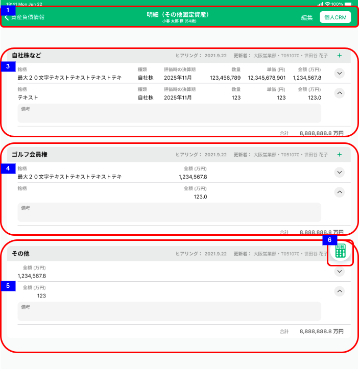
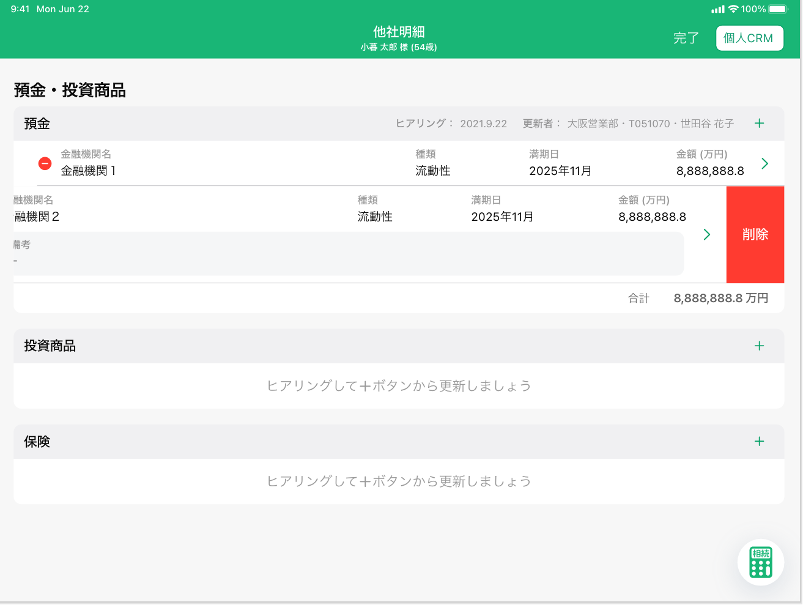

# 資産負債情報明細一覧（その他固定資産）

## 概要

資産負債情報の明細（その他固定資産）を確認するための画面

## 画面遷移

N/A

## 画面レイアウト図

- 資産負債情報明細一覧（その他固定資産）View



## 画面項目

> :point_up: 麻布支店ユーザーでログインし、顧客ID"13001003000"の資産負債収入情報トップ画面のうち、預金投資商品カードの他社資産明細をタップすることで確認できる。

1. ヘッダー
    - 資産負債情報リンク
        - [x] タップすると、[資産負債収入情報トップ画面への遷移イベント](#資産負債収入情報トップ画面への遷移)を実行する。
    - 画面名
        - [x] "明細（その他固定資産）"を表示する。
    - 顧客情報
        - [x] 顧客詳細画面にて表示されている対象顧客の氏名と年齢を表示する。
        - [x] 顧客詳細画面にて年齢が表示されていない場合、年齢（-歳）を表示する。
    - 編集ボタン
        - [x] タップすると、編集モードで画面を表示する。編集ボタンが完了ボタンに反転し、資産負債情報リンクは非表示となる。明細カードの左側にマイナスサークルボタンが表示される。
        
    - 個人CRMリンク
        - [x] タップすると[個人CRMへの遷移イベント](#個人CRMへの遷移)を実行する。
2. 画面名
    - [x] ~~"その他固定資産"を表示する。~~ （分類はナビゲーションバーに表示するため削除）
3. 自社株などエリア
    - ヘッダー
        - エリア名
            - [x] "自社株など"を表示する。
        - ヒアリング情報
            - [x] 明細が存在しない場合、何も表示しない。
            - ヒアリング
                - [x] 分類が"自社株など"の明細のうち最終更新日時が最も新しいものの、最終更新年月日を`YYYY.MM.DD`の形式で表示する。

            ```md
                存在するデータの中で最も大きい日付を表示するので、最も大きい日付が削除された場合、次に大きい日付が表示されることとなる。
                例: 1明細のみ登録されたデータを削除した場合、
                ①何も登録していない状態（更新日「まだヒアリングしていません」と表示される状態）
                ②1/31　1明細を登録
                ③2/1　  ②で登録した1明細を削除
                → ヒアリングには「まだヒアリングしていません」が表示される。
            ```

            - 更新者
                - [x] 分類が"自社株など"の明細のうち最終更新日時が最も新しいものの、更新者情報を`支店名・R2ID・更新者名`の形式で表示する。
                - [x] 更新者が退職済みの場合、所属店名、R2ID、更新者氏名を表示する。
                - [x] 所属店名が不明な場合、「不明な支店」を表示する。
        - 明細追加ボタン
            - [x] "＋"ボタンを表示する。
            - [x] タップすると[追加ボタン（自社株などエリア）をタップ](#追加ボタン（自社株などエリア）をタップ)を実行する。
    - 明細カード
        - [x] 明細が存在しない場合は、"ヒアリングして+ボタンから更新しましょう"が表示される。
        - [x] 明細が存在する場合は、明細が追加された順（明細ID）の昇順でソートされていること。
        - [x] 編集モード（各明細にマイナスサークルボタンが表示された状態）で明細をタップすると明細追加・編集ダイアログ（その他-自社株など）に遷移する。
        - マイナスサークルボタン
            - [x] ヘッダーの編集ボタンをタップすると出現する。
            - [x] マイナスサークルボタンをタップすると、非表示になり、明細右端に削除ボタンを表示する。
            - [x] 削除ボタンが表示された状態で明細をタップすると再表示する。
        - 銘柄
            - [x] 存在しない場合はブランクで表示される。
            - [x] 存在する場合は銘柄が表示される。
        - 種類
            - [x] "未選択"の場合、ブランクで表示される。
            - [x] "自社株", "その他"が表示される。
        - 評価時の決算期
            - [x] 存在しない場合はブランクで表示される。
            - [x] 存在する場合、年月が明瞭な場合は"YYYY年M月"が表示される。
            - [x] 存在する場合、年が不明な場合は"----年M月"が表示される。
            - [x] 存在する場合、月が不明な場合は"YYYY年--月"が表示される。
        - 数量
            - [x] 存在しない場合はブランクで表示される。
            - [x] 存在する場合は数量は単位なしで整数で表示される。
        - 単価
            - [x] 存在しない場合はブランクで表示される。
            - [x] 存在する場合は対象の金額が"円"単位で整数で表示される。
        - 金額
            - [x] 存在しない場合はブランクで表示される。
            - [x] 存在する場合は対象の金額が"万円"単位で小数点第一位まで表示される。
        - アコーディオンボタン
            - [x] タップすると、シェブロンが180度反転し"備考"が表示される。
            - [x] "備考"が表示された状態で再度タップすると、シェブロンが戻り、"備考"が隠れる。
        - 備考
            - [x] アコーディオンボタンがタップされると出現する。
            - [x] 存在しない場合はブランクで表示される。
            - [x] 存在する場合は、対象の備考が表示される。
            - [x] 備考の記載、全文が確認できる
            - [x] 文字数に合わせてテキストエリアの高さが変わる
            - [x] 改行が正しく表示される。
        - 削除ボタン
            - [x] マイナスサークルボタンをタップすると出現する。
            - [x] 明細を右から左にスワイプすると出現する。
            - [x] 削除ボタンが表示された状態で明細がタップすると非表示になる。
            - [x] タップすると[削除ボタンをタップ](#削除ボタンをタップ)を実行する。
    - フッター
        - [x] 明細が存在しない場合は、フッターは表示されない。
        - [x] 各明細の金額の合計額が"万円"単位で小数点第一位まで表示される。
        - [x] 明細のうち金額が存在しないものは加算されない。

4. ゴルフ会員権
    - ヘッダー
        - エリア名
            - [x] "ゴルフ会員権"を表示する。
        - ヒアリング情報
            - [x] 明細が存在しない場合、何も表示しない。
            - ヒアリング
                - [x] 分類が"ゴルフ会員権"の明細のうち最終更新日時が最も新しいものの、最終更新年月日を`YYYY.MM.DD`の形式で表示する。

            ```md
                存在するデータの中で最も大きい日付を表示するので、最も大きい日付が削除された場合、次に大きい日付が表示されることとなる。
                例: 1明細のみ登録されたデータを削除した場合、
                ①何も登録していない状態（更新日「まだヒアリングしていません」と表示される状態）
                ②1/31　1明細を登録
                ③2/1　  ②で登録した1明細を削除
                → ヒアリングには「まだヒアリングしていません」が表示される。
            ```

            - 更新者
                - [x] 分類が"ゴルフ会員権"の明細のうち最終更新日時が最も新しいものの、更新者情報を`支店名・R2ID・更新者名`の形式で表示する。
                - [x] 更新者が退職済みの場合、所属店名、R2ID、更新者氏名を表示する。
                - [x] 所属店名が不明な場合、「不明な支店」を表示する。
        - 明細追加ボタン
            - [x] "＋"ボタンを表示する。
            - [x] タップすると[追加ボタン（ゴルフ会員権エリア）をタップ](#追加ボタン（ゴルフ会員権エリア）をタップ)を実行する。
    - 明細カード
        - [x] 明細が存在しない場合は、"ヒアリングして+ボタンから更新しましょう"が表示される。
        - [x] 明細が存在する場合は、明細が追加された順（明細ID）の昇順でソートされていること。
        - [x] 編集モード（各明細にマイナスサークルボタンが表示された状態）で明細をタップすると明細追加・編集ダイアログ（その他-ゴルフ会員権）に遷移する。
        - マイナスサークルボタン
            - [x] ヘッダーの編集ボタンをタップすると出現する。
            - [x] マイナスサークルボタンをタップすると、非表示になり、明細右端に削除ボタンを表示する。
            - [x] 削除ボタンが表示された状態で明細をタップすると再表示する。
        - 銘柄
            - [x] 存在しない場合はブランクで表示される。
            - [x] 存在する場合は銘柄が表示される。
        - 金額
            - [x] 存在しない場合はブランクで表示される。
            - [x] 存在する場合は対象の金額が"万円"単位で小数点第一位まで表示される。
            - アコーディオンボタン
            - [x] タップすると、シェブロンが180度反転し"備考"が表示される。
            - [x] "備考"が表示された状態で再度タップすると、シェブロンが戻り、"備考"が隠れる。
        - 備考
            - [x] アコーディオンボタンがタップされると出現する。
            - [x] 存在しない場合はブランクで表示される。
            - [x] 存在する場合は、対象の備考が表示される。
            - [x] 備考の記載、全文が確認できる
            - [x] 文字数に合わせてテキストエリアの高さが変わる
            - [x] 改行が正しく表示される。
        - 削除ボタン
            - [x] マイナスサークルボタンをタップすると出現する。
            - [x] 明細を右から左にスワイプすると出現する。
            - [x] 削除ボタンが表示された状態で明細をタップすると非表示になる。
            - [x] タップすると[削除ボタンをタップ](#削除ボタンをタップ)を実行する。
    - フッター
        - [x] 明細が存在しない場合は、フッターは表示されない。
        - [x] 各明細の金額の合計額が"万円"単位で小数点第一位まで表示される。
        - [x] 明細のうち金額が存在しないものは加算されない。
5. その他エリア
    - ヘッダー
        - エリア名
            - [x] "その他"を表示する。
        - ヒアリング情報
            - [x] 明細が存在しない場合、何も表示しない。
            - ヒアリング
                - [x] 分類が"その他"の明細のうち最終更新日時が最も新しいものの、最終更新年月日を`YYYY.MM.DD`の形式で表示する。

                ```md
                    存在するデータの中で最も大きい日付を表示するので、最も大きい日付が削除された場合、次に大きい日付が表示されることとなる。
                    例: 1明細のみ登録されたデータを削除した場合、
                    ①何も登録していない状態（更新日「まだヒアリングしていません」と表示される状態）
                    ②1/31　1明細を登録
                    ③2/1　  ②で登録した1明細を削除
                    → ヒアリングには「まだヒアリングしていません」が表示される。
                ```

            - 更新者
                - [x] 分類が"その他"の明細のうち最終更新日時が最も新しいものの、更新者情報を`支店名・R2ID・更新者名`の形式で表示する。
                - [x] 更新者が退職済みの場合、所属店名、R2ID、更新者氏名を表示する。
                - [x] 所属店名が不明な場合、「不明な支店」を表示する。
        - 明細追加ボタン
            - [x] "＋"ボタンを表示する。
            - [x] タップすると[追加ボタン（その他エリア）をタップ](#追加ボタン（その他エリア）をタップ)を実行する。
    - 明細カード
        - [x] 明細が存在しない場合は、"ヒアリングして+ボタンから更新しましょう"が表示される。
        - [x] 明細が存在する場合は、明細が追加された順（明細ID）の昇順でソートされていること。
        - [x] 編集モード（各明細にマイナスサークルボタンが表示された状態）で明細をタップすると明細追加・編集ダイアログ（その他-その他）に遷移する。
        - マイナスサークルボタン
            - [x] ヘッダーの編集ボタンをタップすると出現する。
            - [x] マイナスサークルボタンをタップすると、非表示になり、明細右端に削除ボタンを表示する。
            - [x] 削除ボタンが表示された状態で明細をタップすると再表示する。
        - 金額
            - [x] 存在しない場合はブランクで表示される。
            - [x] 存在する場合は対象の金額が"万円"単位で小数点第一位まで表示される。
            - アコーディオンボタン
            - [x] タップすると、シェブロンが180度反転し"備考"が表示される。
            - [x] "備考"が表示された状態で再度タップすると、シェブロンが戻り、"備考"が隠れる。
        - 備考
            - [x] アコーディオンボタンがタップされると出現する。
            - [x] 存在しない場合はブランクで表示される。
            - [x] 存在する場合は、対象の備考が表示される。
            - [x] 備考の記載、全文が確認できる
            - [x] 文字数に合わせてテキストエリアの高さが変わる
            - [x] 改行が正しく表示される。
        - 削除ボタン
            - [x] マイナスサークルボタンをタップすると出現する。
            - [x] 明細を右から左にスワイプすると出現する。
            - [x] 削除ボタンが表示された状態で明細がタップすると非表示になる。
            - [x] タップすると[削除ボタンをタップ](#削除ボタンをタップ)を実行する。
    - フッター
        - [x] 明細が存在しない場合は、フッターは表示されない。
        - [x] 各明細の金額の合計額が"万円"単位で小数点第一位まで表示される。
        - [x] 明細のうち金額が存在しないものは加算されない。
6. 相続税計算
    - [x] タップすると、[相続税計算](#相続税計算ボタンをタップ) を実行する。

## イベント

この項では、当画面にて実行されるイベント一覧を記述する。

### 資産負債収入情報トップ画面への遷移

- [x] 資産負債収入情報トップ画面に遷移する。

### 個人CRMへの遷移

- [x] 個人CRM（他システム）に遷移する。

### 追加ボタン（自社株などエリア）をタップ

- [x] 明細追加・編集ダイアログ（その他-自社株など）に遷移する。

### 追加ボタン（ゴルフ会員権エリア）をタップ

- [x] 明細追加・編集ダイアログ（その他-ゴルフ会員権）に遷移する。

### 追加ボタン（その他エリア）をタップ

- [x] 明細追加・編集ダイアログ（その他-その他）に遷移する。

### 削除ボタンをタップ

- [x] ポップアップメッセージ「(タイトル)明細を削除します。(本文)この操作は取り消すことができません。(キャンセル/削除)」が表示される。
- [x] ポップアップメッセージに対して、削除をタップすると 該当の明細が削除され、該当分類の合計金額を集計、表示する。
- [x] ポップアップメッセージに対して、キャンセルをタップすると当画面(編集モード)に戻る。

### 相続税計算ボタンをタップ

[相続税簡易シミュレーション入力](../相続税簡易シミュレーション/相続税簡易シミュレーション入力.md)を表示する。
