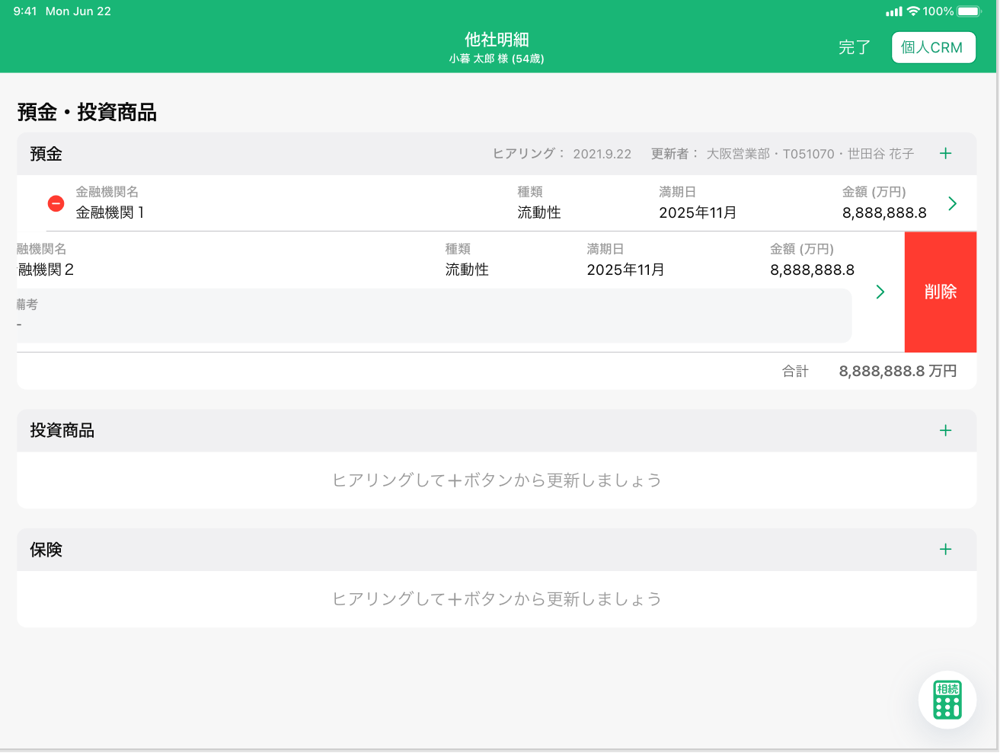

# 資産負債情報明細一覧（預金・投資商品）

## 概要

資産負債情報の明細（預金・投資商品）を確認するための画面

## 画面遷移

N/A

## 画面レイアウト図

- 資産負債情報明細一覧（預金・投資商品）View


## 画面項目

> :point_up: 麻布支店ユーザーでログインし、顧客ID"13001003000"の資産負債収入情報トップ画面のうち、預金投資商品カードの他社資産明細をタップすることで確認できる。

1. ヘッダー
    - 資産負債情報リンク
        - [x] タップすると、[資産負債収入情報トップ画面への遷移イベント](#資産負債収入情報トップ画面への遷移)を実行する。
    - 画面名
        - [x] "明細（預金・投資商品）"を表示する。
    - 顧客情報
        - [x] 顧客詳細画面にて表示されている対象顧客の氏名と年齢を表示する。
        - [x] 顧客詳細画面にて年齢が表示されていない場合、年齢（-歳）を表示する。
    - 編集ボタン
        - [x] タップすると、編集モードで画面を表示する。編集ボタンが完了ボタンに反転し、資産負債情報リンクは非表示となる。預金エリア、投資商品エリア、保険エリアの明細カードの左側にマイナスサークルボタンが表示される。
        
    - 個人CRMリンク
        - [x] タップすると[個人CRMへの遷移イベント](#個人CRMへの遷移)を実行する。
2. 画面名
    - [x] ~~"預金・投資商品"を表示する。~~ （分類はナビゲーションバーに表示するため削除）
3. 預金エリア
    - ヘッダー
        - エリア名
            - [x] "預金"を表示する。
        - ヒアリング情報
            - [x] 明細が存在しない場合、何も表示しない。
            - ヒアリング
                - [x] 分類が"預金"の明細のうち最終更新日時が最も新しいものの、最終更新年月日を`YYYY.MM.DD`の形式で表示する。

                ```md
                    存在するデータの中で最も大きい日付を表示するので、最も大きい日付が削除された場合、次に大きい日付が表示されることとなる。
                    例: 1明細のみ登録されたデータを削除した場合、
                    ①何も登録していない状態（更新日「まだヒアリングしていません」と表示される状態）
                    ②1/31　1明細を登録
                    ③2/1　  ②で登録した1明細を削除
                    → ヒアリングには「まだヒアリングしていません」が表示される。
                ```

            - 更新者
                - [x] 分類が"預金"の明細のうち最終更新日時が最も新しいものの、更新者情報を`支店名・R2ID・更新者名`の形式で表示する。
                - [x] 更新者が退職済みの場合、所属店名、R2ID、更新者氏名を表示する。
                - [x] 所属店名が不明な場合、「不明な支店」を表示する。
        - 明細追加ボタン
            - [x] "＋"ボタンを表示する。
            - [x] タップすると[追加ボタン（預金エリア）をタップ](#追加ボタン（預金エリア）をタップ)を実行する。
    - 他社セクションヘッダー
        - [ ] "他社"と表示された薄いグレーのセクションヘッダーが表示される。
    - 明細カード
        - [x] 明細が存在しない場合は、"ヒアリングして+ボタンから更新しましょう"が表示される。
        - [x] 明細が存在する場合は、明細が追加された順（明細ID）の昇順でソートされていること。
        - [x] 編集モード（各明細にマイナスサークルボタンが表示された状態）で明細をタップすると明細追加・編集ダイアログ（預金・投資商品-預金）に遷移する。
        - マイナスサークルボタン
            - [x] ヘッダーの編集ボタンをタップすると出現する。
            - [x] マイナスサークルボタンをタップすると、非表示になり、明細右端に削除ボタンを表示する。
            - [x] 削除ボタンが表示された状態で明細をタップすると再表示する。
        - 金融機関名
            - [x] 存在しない場合はブランクで表示される。
            - [x] 存在する場合は対象の機関名が表示される。
        - 種類
            - [x] "未選択"の場合、ブランクで表示される。
            - [x] "流動性", "固定性"が表示される。
        - 満期日
            - [x] 存在しない場合はブランクで表示される。
            - [x] 存在する場合、年月が明瞭な場合は"YYYY年M月"が表示される。
            - [x] 存在する場合、年が不明な場合は"----年M月"が表示される。
            - [x] 存在する場合、月が不明な場合は"YYYY年--月"が表示される。
        - 金額
            - [x] 存在しない場合はブランクで表示される。
            - [x] 存在する場合は対象の金額が"万円"単位で小数点第一位まで表示される。
            - [x] 小数が存在しない場合は整数のみ表示される。
        - アコーディオンボタン
            - [x] タップすると、シェブロンが180度反転し"備考"が表示される。
            - [x] "備考"が表示された状態で再度タップすると、シェブロンが戻り、"備考"が隠れる。
        - 備考
            - [x] アコーディオンボタンがタップされると出現する。
            - [x] 存在する場合は、対象の備考が表示される。
            - [x] 備考の記載、全文が確認できる
            - [x] 文字数に合わせてテキストエリアの高さが変わる
            - [x] 改行が正しく表示される。
        - 削除ボタン
            - [x] マイナスサークルボタンをタップすると出現する。
            - [x] 明細を右から左にスワイプすると出現する。
            - [x] 削除ボタンが表示された状態で明細がタップすると非表示になる。
            - [x] タップすると[削除ボタンをタップ](#削除ボタンをタップ)を実行する。
    - 他社小計
        - [ ] 明細が存在しない場合表示されない。
        - [ ] 明細金額の合計が `小計 <合計金額>万円`の形式で表示される。
        - [ ] 合計金額は"万円"単位で小数点第一位まで表示される。
        - [ ] 明細のうち金額が存在しないものは加算されない。
    - 当社セクションヘッダー
        - [ ] "当社"と表示された薄いグレーのセクションヘッダーが表示される。
        - [ ] 右端にCRM預り資産サマリーAPIから取得した明細（流動性預金 + 固定性預金）のうち最も新しい日付の基準日が`YYYY.M.D`形式で表示される。（CRM預り資産サマリーAPIではすべて同じ基準日を返すため必ず一致する。）
    - 当社小計
        - [ ] 他社明細が存在しない場合、当社小計も表示されない。
        - [ ] CRM預り資産サマリーAPIから取得した明細（流動性預金 + 固定性預金）金額の合計が `小計 <合計金額>万円`の形式で表示される。
        - [ ] 合計金額は"万円"単位で小数点第一位まで表示される。
    - 合計
        - [ ] 他社小計と当社小計の合計金額が"万円"単位で小数点第一位まで表示される。
4. 投資商品エリア
    - ヘッダー
        - エリア名
            - [x] "投資商品"を表示する。
        - ヒアリング情報
            - [x] 明細が存在しない場合、何も表示しない。
            - ヒアリング
                - [x] 分類が"投資商品"の明細のうち最終更新日時が最も新しいものの、最終更新年月日を`YYYY.MM.DD`の形式で表示する。

                ```md
                    存在するデータの中で最も大きい日付を表示するので、最も大きい日付が削除された場合、次に大きい日付が表示されることとなる。
                    例: 1明細のみ登録されたデータを削除した場合、
                    ①何も登録していない状態（更新日「まだヒアリングしていません」と表示される状態）
                    ②1/31　1明細を登録
                    ③2/1　  ②で登録した1明細を削除
                    → ヒアリングには「まだヒアリングしていません」が表示される。
                ```

            - 更新者
                - [x] 分類が"投資商品"の明細のうち最終更新日時が最も新しいものの、更新者情報を`支店名・R2ID・更新者名`の形式で表示する。
                - [x] 更新者が退職済みの場合、所属店名、R2ID、更新者氏名を表示する。
                - [x] 所属店名が不明な場合、「不明な支店」を表示する。
        - 明細追加ボタン
            - [x] "＋"ボタンを表示する。
            - [x] タップすると[追加ボタン（投資商品エリア）をタップ](#追加ボタン（投資商品エリア）をタップ)を実行する。
    - 他社セクションヘッダー
        - [ ] "他社"と表示された薄いグレーのセクションヘッダーが表示される。
    - 明細カード
        - [x] 明細が存在しない場合は、"ヒアリングして+ボタンから更新しましょう"が表示される。
        - [x] 明細が存在する場合は、明細が追加された順（明細ID）の昇順でソートされていること。
        - [x] 編集モード（各明細にマイナスサークルボタンが表示された状態）で明細をタップすると明細追加・編集ダイアログ（預金・投資商品-投資商品）に遷移する。
        - マイナスサークルボタン
            - [x] ヘッダーの編集ボタンをタップすると出現する。
            - [x] マイナスサークルボタンをタップすると、非表示になり、明細右端に削除ボタンを表示する。
            - [x] 削除ボタンが表示された状態で明細をタップすると再表示する。
        - 金融機関名
            - [x] 存在しない場合はブランクで表示される。
            - [x] 存在する場合は対象の機関名が表示される。
        - 種類
            - [x] "未選択"の場合、ブランクで表示される。
            - [x] "投資信託", "外貨預金","公共債", "上場株式", "その他"が表示される。
        - 満期日
            - [x] 存在しない場合はブランクで表示される。
            - [x] 存在する場合、年月が明瞭な場合は"YYYY年M月"が表示される。
            - [x] 存在する場合、年が不明な場合は"----年M月"が表示される。
            - [x] 存在する場合、月が不明な場合は"YYYY年--月"が表示される。
        - 金額
            - [x] 存在しない場合はブランクで表示される。
            - [x] 存在する場合は対象の金額が"万円"単位で小数点第一位まで表示される。
            - [x] 小数が存在しない場合は整数のみ表示される。
        - アコーディオンボタン
            - [x] タップすると、シェブロンが180度反転し"備考"が表示される。
            - [x] "備考"が表示された状態で再度タップすると、シェブロンが戻り、"備考"が隠れる。
        - 備考
            - [x] アコーディオンボタンがタップされると出現する。
            - [x] 存在する場合は、対象の備考が表示される。
            - [x] 備考の記載、全文が確認できる
            - [x] 文字数に合わせてテキストエリアの高さが変わる
            - [x] 改行が正しく表示される。
        - 削除ボタン
            - [x] マイナスサークルボタンをタップすると出現する。
            - [x] 明細を右から左にスワイプすると出現する。
            - [x] 削除ボタンが表示された状態で明細がタップすると非表示になる。
            - [x] タップすると[削除ボタンをタップ](#削除ボタンをタップ)を実行する。
    - 他社小計
        - [ ] 明細が存在しない場合表示されない。
        - [ ] 明細金額の合計が `小計 <合計金額>万円`の形式で表示される。
        - [ ] 合計金額は"万円"単位で小数点第一位まで表示される。
        - [ ] 明細のうち金額が存在しないものは加算されない。
    - 当社セクションヘッダー
        - [ ] "当社"と表示された薄いグレーのセクションヘッダーが表示される。
        - [ ] 右端にCRM預り資産サマリーAPIから取得した明細（外貨預金 + 投資信託 + ファンドラップ + 実績配当型金銭信託 + 公共債 + 金融仲介商品）のうち最も新しい日付の基準日が`YYYY.M.D`形式で表示される。（CRM預り資産サマリーAPIではすべて同じ基準日を返すため必ず一致する。）
    - 当社小計
        - [ ] 他社明細が存在しない場合、当社小計も表示されない。
        - [ ] CRM預り資産サマリーAPIから取得した明細（外貨預金 + 投資信託 + ファンドラップ + 実績配当型金銭信託 + 公共債 + 金融仲介商品）金額の合計が `小計 <合計金額>万円`の形式で表示される。
        - [ ] 合計金額は"万円"単位で小数点第一位まで表示される。
    - 合計
        - [ ] 他社小計と当社小計の合計金額が"万円"単位で小数点第一位まで表示される。
5. 保険エリア
    - ヘッダー
        - エリア名
            - [x] "保険"を表示する。
        - ヒアリング情報
            - [x] 明細が存在しない場合、何も表示しない。
            - ヒアリング
                - [x] 分類が"保険"の明細のうち最終更新日時が最も新しいものの、最終更新年月日を`YYYY.MM.DD`の形式で表示する。

                ```md
                    存在するデータの中で最も大きい日付を表示するので、最も大きい日付が削除された場合、次に大きい日付が表示されることとなる。
                    例: 1明細のみ登録されたデータを削除した場合、
                    ①何も登録していない状態（更新日「まだヒアリングしていません」と表示される状態）
                    ②1/31　1明細を登録
                    ③2/1　  ②で登録した1明細を削除
                    → ヒアリングには「まだヒアリングしていません」が表示される。
                ```

            - 更新者
                - [x] 分類が"保険"の明細のうち最終更新日時が最も新しいものの、更新者情報を`支店名・R2ID・更新者名`の形式で表示する。
                - [x] 更新者が退職済みの場合、所属店名、R2ID、更新者氏名を表示する。
                - [x] 所属店名が不明な場合、「不明な支店」を表示する。
        - 明細追加ボタン
            - [x] "＋"ボタンを表示する。
            - [x] タップすると[追加ボタン（保険エリア）をタップ](#追加ボタン（保険エリア）をタップ)を実行する。
    - 他社セクションヘッダー
        - [ ] "他社"と表示された薄いグレーのセクションヘッダーが表示される。
    - 明細カード
        - [x] 明細が存在しない場合は、"ヒアリングして+ボタンから更新しましょう"が表示される。
        - [x] 明細が存在する場合は、明細が追加された順（明細ID）の昇順でソートされていること。
        - [x] 編集モード（各明細にマイナスサークルボタンが表示された状態）で明細をタップすると明細追加・編集ダイアログ（預金・投資-保険）に遷移する。
        - マイナスサークルボタン
            - [x] ヘッダーの編集ボタンをタップすると出現する。
            - [x] マイナスサークルボタンをタップすると、非表示になり、明細右端に削除ボタンを表示する。
            - [x] 削除ボタンが表示された状態で明細をタップすると再表示する。
        - 金融機関名
            - [x] 存在しない場合はブランクで表示される。
            - [x] 存在する場合は対象の機関名が表示される。
            - [x] 文字の全長が、表示領域を超える場合、三点リードの領域を含んだ文字数分が表示される。例:  123456789銀...
        - 目的
            - [x] 存在しない場合、ブランクで表示される。
            - [x] 存在する場合、それぞれ"、"で区切られて表示される。4つ以上存在する場合は、4つ目が"..."として3つまで表示される。例: 死亡保険、学費、年金、…
            - [x] "死亡保証", "学資", "年金", "運用", "医療", "介護"のうち該当するものが表示される。
        - 契約日
            - [x] 存在しない場合はブランクで表示される。
            - [x] 存在する場合、年月が明瞭な場合は"YYYY年M月"が表示される。
            - [x] 存在する場合、年が不明な場合は"----年M月"が表示される。
            - [x] 存在する場合、月が不明な場合は"YYYY年--月"が表示される。
        - 満期日
            - [x] 存在しない場合はブランクで表示される。
            - [x] 存在する場合、年月が明瞭な場合は"YYYY年M月"が表示される。
            - [x] 存在する場合、年が不明な場合は"----年M月"が表示される。
            - [x] 存在する場合、月が不明な場合は"YYYY年--月"が表示される。
        - 相続税対象外
            - [x] falseの場合は何も表示されない。
            - [x] trueの場合は"該当"が表示される。
        - 掛け捨て
            - [x] falseの場合は何も表示されない。
            - [x] trueの場合は"該当"が表示される。
        - 受取予定金額
            - [x] 存在しない場合はブランクで表示される。
            - [x] 存在する場合は対象の金額が"万円"単位で小数点第一位まで表示される。
        - アコーディオンボタン
            - [x] タップすると、シェブロンが180度反転し"受取人1", "続柄1", "割合1", "受取人2", "続柄2", "割合2", "贈与", "払込方法", "通貨", "備考"が表示される。
            - [x] "備考"が表示された状態で再度タップすると、シェブロンが戻り、"受取人1", "続柄1", "割合1", "受取人2", "続柄2", "割合2", "贈与", "払込方法", "通貨", "備考"が隠れる。
        - 受取人1
            - [x] アコーディオンボタンがタップされると出現する。
            - [x] 存在しない場合はブランクで表示される。
            - [x] 存在する場合は、対象の受取人1が表示される。
        - 続柄1
            - [x] アコーディオンボタンがタップされると出現する。
            - [x] 存在しない場合はブランクで表示される。
            - [x] 存在する場合は、"本人", "父", "母", "配偶者", "他パートナー", "子", "子の配偶者", "孫", "きょうだい", "きょうだいの配偶者", "甥姪", "その他"が表示される。
        - 割合1
            - [x] アコーディオンボタンがタップされると出現する。
            - [x] 存在しない場合はブランクで表示される。
            - [x] 存在する場合は対象の割合1が表示される。
        - 受取人2
            - [x] アコーディオンボタンがタップされると出現する。
            - [x] 存在しない場合はブランクで表示される。
            - [x] 存在する場合は、対象の受取人2が表示される。
        - 続柄2
            - [x] アコーディオンボタンがタップされると出現する。
            - [x] 存在しない場合はブランクで表示される。
            - [x] 存在する場合は、"本人", "父", "母", "配偶者", "その他のパートナー", "子", "子の配偶者", "孫", "きょうだい", "きょうだいの配偶者", "甥姪", "その他"が表示される。
        - 割合2
            - [x] アコーディオンボタンがタップされると出現する。
            - [x] 存在しない場合はブランクで表示される。
            - [x] 存在する場合は対象の割合2が表示される。
        - 贈与  
            - [x] アコーディオンボタンがタップされると出現する。
            - [x] "未選択"の場合、ブランクで表示される。
            - [x] "有り", "無し"が表示される。
        - 払込方法
            - [x] アコーディオンボタンがタップされると出現する。
            - [x] "未選択"の場合、ブランクで表示される。
            - [x] "一時払い", "平準払い"が表示される。
        - 通貨
            - [x] アコーディオンボタンがタップされると出現する。
            - [x] "未選択"の場合、ブランクで表示される。
            - [x] "JPY", "USD", "AUD", "EUR", "その他"が表示される。
        - 備考
            - [x] アコーディオンボタンがタップされると出現する。
            - [x] 存在する場合は、対象の備考が表示される。
            - [x] 備考の記載、全文が確認できる
            - [x] 文字数に合わせてテキストエリアの高さが変わる
            - [x] 改行が正しく表示される。
        - 削除ボタン
            - [x] マイナスサークルボタンをタップすると出現する。
            - [x] 明細を右から左にスワイプすると出現する。
            - [x] 削除ボタンが表示された状態で明細がタップすると非表示になる。
            - [x] タップすると[削除ボタンをタップ](#削除ボタンをタップ)を実行する。
    - 他社小計
        - [ ] 明細が存在しない場合表示されない。
        - [ ] 明細金額の合計が `（掛け捨て除く）小計 <合計金額>万円`の形式で表示される。
        - [ ] 合計金額は"万円"単位で小数点第一位まで表示される。
        - [ ] 明細のうち金額が存在しないものは加算されない。
        - [ ] 明細のうち掛け捨て保険が"該当"となっているものは加算されない。
    - 当社セクションヘッダー
        - [ ] "当社"と表示された薄いグレーのセクションヘッダーが表示される。
        - [ ] 右端にCRM預り資産サマリーAPIから取得した明細（生命保険）の基準日が`YYYY.M.D`形式で表示される。
    - 当社小計
        - [ ] 他社明細が存在しない場合、当社小計も表示されない。
        - [ ] CRM預り資産サマリーAPIから取得した明細（生命保険）金額が `小計 <合計金額>万円`の形式で表示される。
        - [ ] 合計金額は"万円"単位で小数点第一位まで表示される。
    - 合計
        - [ ] 他社小計と当社小計の合計金額が"万円"単位で小数点第一位まで表示される。
6. 相続税計算
    - [x] タップすると、[相続税計算](#相続税計算ボタンをタップ) を実行する。

## イベント

この項では、当画面にて実行されるイベント一覧を記述する。

### 資産負債収入情報トップ画面への遷移

- [x] 資産負債収入情報トップ画面に遷移する。

### 個人CRMへの遷移

- [x] 個人CRM（他システム）に遷移する。

### 追加ボタン（預金エリア）をタップ

- [x] 明細追加・編集ダイアログ（預金・投資商品-預金）に遷移する。


### 追加ボタン（投資商品エリア）をタップ

- [x] 明細追加・編集ダイアログ（預金・投資-投資商品）に遷移する。


### 追加ボタン（保険エリア）をタップ

- [x] 明細追加・編集ダイアログ（預金・投資-保険）に遷移する。

### 削除ボタンをタップ

- [x] ポップアップメッセージ「(タイトル)明細を削除します。(本文)この操作は取り消すことができません。(キャンセル/削除)」が表示される。
- [x] ポップアップメッセージに対して、削除をタップすると 該当の明細が削除され、該当分類の合計金額を集計、表示する。
- [x] ポップアップメッセージに対して、キャンセルをタップすると当画面(編集モード)に戻る。

### 相続税計算ボタンをタップ

[相続税簡易シミュレーション入力](../相続税簡易シミュレーション/相続税簡易シミュレーション入力.md)を表示する。
