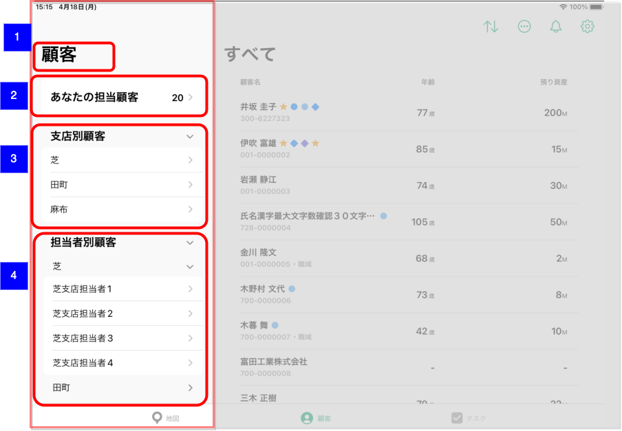

# 担当支店・担当者選択選択

## 概要

担当する顧客一覧への遷移、もしくは顧客を担当するエリア内の支店一覧および支店の担当者を確認、遷移するための画面。

## 画面遷移

N/A

## 画面レイアウト図

- 担当支店・担当者選択選択

## 画面項目

1. 画面名
    - [ ] 「顧客」が表示される。
2. あなたの担当顧客
    - [ ] 「あなたの担当顧客」が表示される。
    - [ ] 担当顧客件数が表示される。
    - [ ] タップすると[あなたの担当顧客をタップ](#あなたの担当顧客をタップ)を実行する。
3. 支店別顧客エリア
    - [ ] エリア店の場合は所属するエリアの支店一覧が表示される。
    - [ ] エリア運営でない支店は所属支店が表示される。
    - [X] 特定の本部所属の担当者の場合、所属支店に加えて[アプリ設定画面](../設定/%E3%82%A2%E3%83%97%E3%83%AA%E8%A8%AD%E5%AE%9A%E3%83%88%E3%83%83%E3%83%97.md)にて設定した支店一覧が表示される。  
    ※特定本部は以下を参照  
    [【RB】所属以外支店の顧客一覧の閲覧を設定できる部店番号の決定](https://devplf.resonabank.co.jp/resonaso/issues/21252)  
    [【SR】所属以外支店の顧客一覧の閲覧を設定できる部店番号の決定](https://devplf.resonabank.co.jp/resonaso/issues/21253)

    - [ ] ヘッダーをタップするとエリアが開閉する。
    - [ ] 支店のセルをタップすると[支店別顧客エリアの支店をタップ](#支店別顧客エリアの支店をタップ)を実行する。
4. 担当者別顧客
    - [ ] エリア店の場合は所属するエリアの支店一覧が表示される。
    - [ ] エリア運営でない支店は所属支店が表示される。
    - [X] 特定の本部所属の担当者の場合、所属支店に加えて[アプリ設定画面](../設定/%E3%82%A2%E3%83%97%E3%83%AA%E8%A8%AD%E5%AE%9A%E3%83%88%E3%83%83%E3%83%97.md)にて設定した支店一覧が表示される。（支店別顧客エリアと同様）
    - [ ] 支店をタップするとその支店の渉外アプリセットアップ済みの（1ヶ月以内に渉外アプリを利用した）担当者一覧を取得する。取得完了後展開し担当者一覧が表示される。
    - [ ] ヘッダーをタップするとエリアが開閉する。
    - [ ] 担当者のセルをタップすると[担当者別顧客エリアの支店をタップ](#担当者別顧客エリアの支店をタップ)を実行する。

## イベント

### あなたの担当顧客をタップ

- [ ] [顧客一覧（担当顧客）](./顧客一覧（担当顧客）.md)に遷移する。

### 支店別顧客エリアの支店をタップ

- [ ] [顧客一覧（支店別）](./顧客一覧（支店別）.md)に遷移する。

### 担当者別顧客エリアの支店をタップ

- [ ] [顧客一覧（支店担当者別）](./顧客一覧（支店担当者別）.md)に遷移する。
