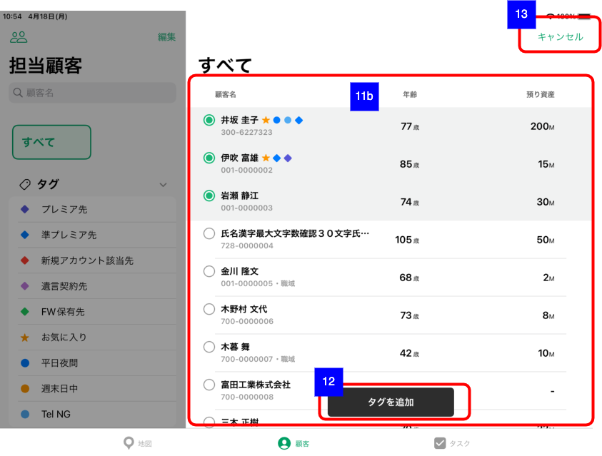

# 顧客一覧（担当顧客）

## 概要

担当顧客一覧を確認するための画面。

## 画面遷移

N/A

## 画面レイアウト図

- 顧客一覧（担当顧客）


- 絞り込み条件編集モード


- 顧客選択モード



## 画面項目

1. 担当支店・担当者選択ボタン
    - [ ] タップすると、[担当支店・担当者選択ボタンをタップ](#担当支店・担当者選択ボタンをタップ)を実行する。
2. 編集ボタン
    - [ ] ボタンラベルに「編集」が表示される。
    - [ ] タップすると、[編集ボタンをタップ](#編集ボタンをタップ)を実行する。
3. 顧客絞り込み条件エリア表示タイトル
    - [ ] 「担当顧客」が表示される。
4. 顧客名検索エリア
    - [ ] プレースホルダーに「顧客名」が表示される。
    - [ ] 文字を入力し変換が確定すると、担当する顧客のうち該当する文字列が氏名もしくは氏名カナに含まれる顧客に絞り込まれて右ペインの顧客一覧に表示される。  
    ※ ひらがなで入力した場合、iOSアプリ側でカタカナに変換してAPI検索が実行される。
5. 絞り込み条件選択エリア
    - 通常モード（**5a**）
        - [ ] 「すべて」ボタンとタグエリアが表示される。
        - [ ] タグエリアにはお気に入りタグと担当者が作成したタグ、本部配信タグが表示される。  
        ※ お気に入りタグは渉外アプリ利用開始時にiOSアプリから自動的に作成される。
        - [ ] タグエリアのヘッダーをタップするとタグエリアが開閉する。
        - [ ] 「すべて」をタップした場合、右ペインの顧客一覧に担当顧客がタグで絞り込まれずに表示される。
        - [ ] タグをタップした場合、担当する顧客のうち選択したタグが付与された顧客に絞り込まれて右ペインの顧客一覧に表示される。
        - [ ] 担当者が作成したタグを左に軽くスワイプすると、右から「引継」ボタンと「削除」ボタンが出現する。
        - [ ] 担当者が作成したタグを左に大きくスワイプすると、[タグの削除ポップアップを表示](#タグの削除ポップアップを表示)を実行する。
        - [ ] タグの引継ボタンをタップすると、[タグの引継ボタンをタップ](#タグの引継ボタンをタップ)を実行する。
        - [ ] タグの削除ボタンをタップすると、[タグの削除ポップアップを表示](#タグの削除ポップアップを表示)を実行する。
        - [ ] お気に入りタグと本部配信タグはスワイプできない。
    - 選択モード（**5b**）
        - [ ] 担当者が作成したタグの左側に赤丸に「-」のアイコン、右側に「i」のアイコンが表示される。
        - [ ] 「-」のアイコンをタップすると、右から「引継」ボタンと「削除」ボタンが出現する。
        - [ ] タグの引継ボタンをタップすると、[タグの引継ボタンをタップ](#タグの引継ボタンをタップ)を実行する。
        - [ ] タグの削除ボタンをタップすると、[タグの削除ポップアップを表示](#タグの削除ポップアップを表示)を実行する。
        - [ ] 「i」のアイコンをタップすると、[タグのiアイコンをタップ](#タグのiアイコンをタップ)を実行する。
        - [ ] タグの右側に並び替えアイコンが表示され、そのアイコンをドラッグ&ドロップすることにより並び替えができる。
        - [ ] 一覧の下に「+タグを追加」ボタンが表示される。
        - [ ] 「+タグを追加」ボタンをタップすると、[タグを追加ボタンをタップ](#タグを追加ボタンをタップ)を実行する。
        - [ ] お気に入りタグと本部配信タグは引継、削除はできない。
6. 並び替えボタン
    - [ ] タップすると、並び替え用メニューとして「顧客名」と「預り資産」が表示される。
    - [ ] 「顧客名」もしくは「預り資産」をタップした場合、選択した条件で顧客一覧の並べ替えを実行する。

    ```markdown
    並び替え条件の名前と降順・昇順の対応は以下の通り。
    顧客名：昇順
    預り資産：降順
    ```
7. メニューボタン
    - [ ] タップすると、[メニューボタンをタップ](#メニューボタンをタップ)を実行する。
8. お知らせボタン
    - [ ] タップすると、[お知らせボタンをタップ](#お知らせボタンをタップ)を実行する。
9. 設定ボタン
    - [ ] タップすると、[設定ボタンをタップ](#設定ボタンをタップ)を実行する。
10. 顧客一覧エリア表示タイトル
    - [ ] 初期状態（左ペインの絞り込み条件選択エリアですべてが選択されている状態）では「すべて」が表示される。
    - [ ] タグを選択している場合、タグ名が表示される。
    - [ ] 顧客名の検索エリアに文字が入力されている場合は、「"<顧客名>" - <タグ名もしくはすべて>」が表示される。
        - 例： "井坂" - プレミア先
11. 顧客一覧エリア
    - 顧客一覧（通常時 **11a**）
        - [ ] 顧客の一覧が表示される。
        - [ ] 初期状態では25件取得する。該当の条件（タグ、地域登録/初期域登録の有無）で25件以上ある場合は一覧を下にスクロールすることで追加読み込みできる。
        - [ ] Pull to Refresh（一覧を下に引っ張ったのち離すこと）で再読み込みできる。
        - [ ] 該当条件で顧客が存在しない場合、画像と「顧客が存在しません。全店検索は<ins>こちら</ins>」が表示される。
        - [ ] 「顧客が存在しません。全店検索は<ins>こちら</ins>」の「こちら」をタップすると[全店顧客検索のリンクをタップ](#全店顧客検索のリンクをタップ)を実行する。
        - [ ] 顧客一覧セルをタップすると、[顧客一覧セルをタップ](#顧客一覧セルをタップ)を実行する。
    - 顧客一覧（選択モード **11b**）
        - [ ] 顧客一覧内左端にチェックボックスが○で表示される。
        - [ ] 顧客一覧内の明細をタップするとチェックボックスの○が選択状態となる（○の中に緑色の●が表示）。
        - [ ] 1件以上顧客が選択される場合「タグを追加」ボタンが表示される。
    - 顧客明細仕様  
    
        1. 顧客氏名
            - [ ] 顧客の氏名が表示される。
        2. タグ
            - [ ] 顧客に付与されたタグが左ペインの絞り込み条件選択エリアと同じタグアイコンで表示される。
        3. 店CIF、職域登録・地域登録情報
            - [x] 顧客の勘定店番とCIF番号が表示される。
            - [x] 職域登録された顧客の場合は、店CIFに続けて中点と「職域」が表示される。
            - [x] 地域登録された顧客の場合は、店CIFに続けて中点と「地域」が表示される。
            - [x] 担当者登録された顧客の場合は、何も表示されない。
        4. 年齢
            - [ ] 個人顧客の場合、顧客の年齢が表示される。
            - [ ] 法人顧客の場合、「-」が表示される。
        5. 預り資産
            - [ ] 個人顧客の場合、顧客の預り資産が小数第一位四捨五入の百万円単位で表示される。
            - [ ] 法人顧客の場合、「-」が表示される。
12. タグを追加ボタン（選択モードで顧客選択時）
    - [ ] タップすると[タグを追加ボタンをタップ（選択モードで顧客選択時）](#タグを追加ボタンをタップ（選択モードで顧客選択時）)を実行する。
13. キャンセルボタン（選択モードで顧客選択時）
    - [ ] タップすると[キャンセルボタンをタップ（選択モードで顧客選択時）](#キャンセルボタンをタップ（選択モードで顧客選択時）)を実行する。
  
## イベント

### 担当支店・担当者選択ボタンをタップ

- [ ] 左ペインに[担当支店・担当者選択](担当支店・担当者選択.md)を表示する。

### 編集ボタンをタップ

- [ ] 左ペインが編集モード（**5b**）、右ペインがグレーアウトされる。
- [ ] ボタンのラベルが「完了」になる。

### タグの引継ボタンをタップ

- [ ] タグ引継画面がモーダル表示される。

### タグの削除ポップアップを表示

- [ ] 削除ポップアップを表示する。
  - [ ] 削除をタップした場合、削除処理を実行する。
    - [ ] タグエリアが再読み込みされ、該当のタグがタグエリアから表示されなくなる。
  - [ ] キャンセルボタンをタップした場合、削除処理を実行せずにポップアップを閉じる。

### タグのiアイコンをタップ

- [ ] タグ編集画面がモーダル表示される。

### タグを追加ボタンをタップ

- [ ] タグ作成画面がモーダル表示される。

### メニューボタンをタップ

- 顧客一覧のメニューとして以下の項目が表示される。
  
  

  - 顧客を選択
    - [ ] 「顧客を選択」をタップすると左ペインがグレーアウト、右ペインが選択モード（**11b**）になる。
    - [ ] 画面上部の6.-9.のボタンは非表示となり、「16. キャンセルボタン（選択モードでタスク選択時）」が表示される。
  - 全店顧客検索
    - [ ] 「全店顧客検索」をタップすると[全店顧客検索のリンクをタップ](#全店顧客検索のリンクをタップ)を実行する。
  - 職域登録顧客を非表示（表示）
    - [x] 初期状態ではラベルに「職域登録顧客を非表示」、右端に目に斜線が入ったアイコンが表示される。
    - [x] ラベルに「職域登録顧客を非表示」、右端に目に斜線が入ったアイコンが表示されている場合、顧客一覧に職域登録された顧客が含まれる。
    - [x] ラベルに「職域登録顧客を表示」、右端に目のアイコン（斜線なし）が表示されている場合、顧客一覧に職域登録された顧客は含まれない。
    - [x] 「職域登録顧客を非表示（表示）」をタップすると、表示/非表示を切り替えることができる。
  - 地域登録顧客を非表示（表示）
    - [x] 初期状態ではラベルに「地域登録顧客を非表示」、右端に目に斜線が入ったアイコンが表示される。
    - [x] ラベルに「地域登録顧客を非表示」、右端に目に斜線が入ったアイコンが表示されている場合、顧客一覧に地域登録された顧客が含まれる。
    - [x] ラベルに「地域登録顧客を表示」、右端に目のアイコン（斜線なし）が表示されている場合、顧客一覧に地域登録された顧客は含まれない。
    - [x] 「地域登録顧客を非表示（表示）」をタップすると、表示/非表示を切り替えることができる。

### お知らせボタンをタップ

- [ ] お知らせ一覧のポップオーバーが表示される。

### 設定ボタンをタップ

- [ ] 設定メニューが表示される。

### 全店顧客検索のリンクをタップ

- [ ] 全店顧客検索画面がモーダル表示される。

### 顧客一覧セルをタップ

- [ ] 対象顧客が閲覧注意顧客の場合、確認アラートを表示する。
  - [ ] タイトル「注意」、メッセージに「業務に関係のない顧客情報の閲覧は「厳禁」です。本部で「モニタリング」をしています。業務外の利用には厳正に対処します。この閲覧は業務上、本当に必要なものですか？※業務上必要な場合は、交渉応対履歴への入力必須。」が表示される。
  - [ ] 「キャンセル」をタップするとアラートを閉じ顧客一覧画面に戻る.
  - [ ] 「OK」をタップすると顧客詳細画面が全画面モーダル表示される。
- [ ] 対象顧客が閲覧注意顧客でない場合、顧客詳細画面が全画面モーダル表示される。

### タグを追加ボタンをタップ（選択モードで顧客選択時）

- [X] 「+新規タグ」ボタンが表示される。
- [X] タグ一覧のうち以下のタグが表示される。
  - お気に入りタグ（☆アイコン）
  - ユーザーが作成したタグ（●アイコン）
  - PC協働先本部配信タグ（■アイコン）
- [X] PC協働先タグ以外の本部配信タグ（◆アイコン）は表示されない。
- [X] 「+新規タグ」ボタンをタップするとタグ作成画面がモーダル表示される。
- タグをタップ
  - [X] 顧客へのタグ付与処理が実行され、処理が完了すると選択モードを終了する。
  - [X] 顧客一覧内の選択した顧客にタグが表示される。

### キャンセルボタンをタップ（選択モードで顧客選択時）

- [ ] 選択モードを終了する。
  