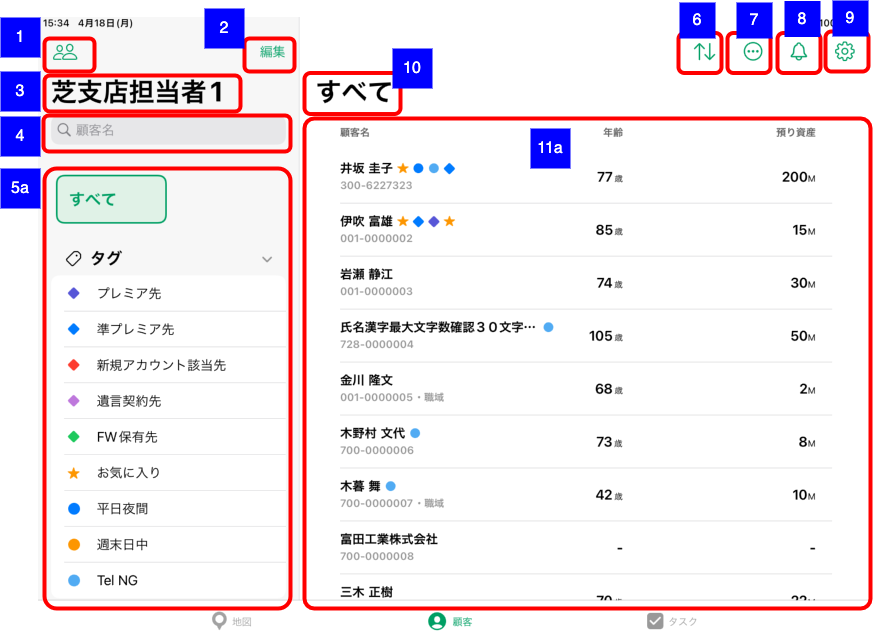
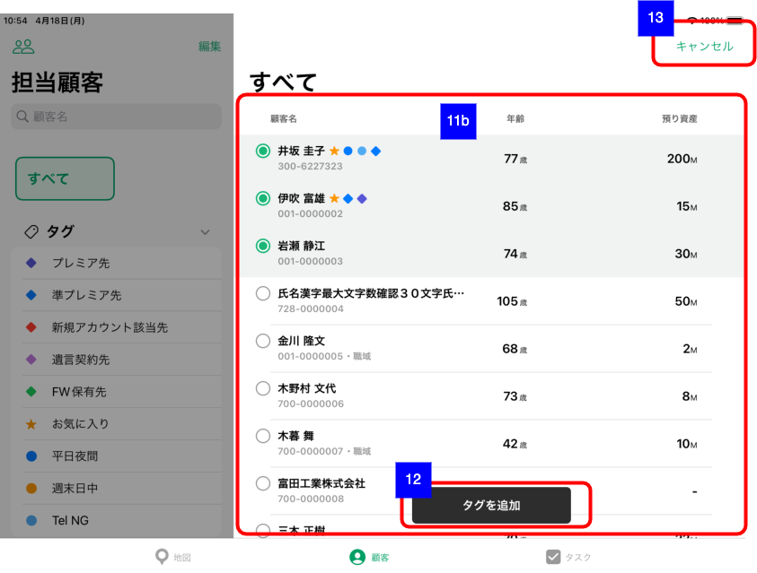

# 顧客一覧（支店担当者別）

## 概要

支店担当者別の顧客一覧を確認するための画面。

## 画面遷移

N/A

## 画面レイアウト図

- 顧客一覧（支店担当者別）

- 顧客選択モード

※ スクリーンショットは顧客一覧（担当顧客）のもの

## 画面項目

1. 担当支店・担当者選択ボタン
    - [ ] [顧客一覧（担当顧客）](./顧客一覧（担当顧客）.md)と同様。
2. 編集ボタン
    - [ ] [顧客一覧（担当顧客）](./顧客一覧（担当顧客）.md)と同様。
3. 顧客絞り込み条件エリア表示タイトル
    - [ ] 担当者氏名が表示される。
4. 顧客名検索エリア
    - [ ] [顧客一覧（担当顧客）](./顧客一覧（担当顧客）.md)と同様。
5. 絞り込み条件選択エリア
    - [ ] [顧客一覧（担当顧客）](./顧客一覧（担当顧客）.md)と同様。
6. 並び替えボタン
    - [ ] [顧客一覧（担当顧客）](./顧客一覧（担当顧客）.md)と同様。
7. メニューボタン
    - [ ] [顧客一覧（担当顧客）](./顧客一覧（担当顧客）.md)と同様。
8. お知らせボタン
    - [ ] [顧客一覧（担当顧客）](./顧客一覧（担当顧客）.md)と同様。
9. 設定ボタン
    - [ ] [顧客一覧（担当顧客）](./顧客一覧（担当顧客）.md)と同様。
10. 顧客一覧エリア表示タイトル
    - [ ] [顧客一覧（担当顧客）](./顧客一覧（担当顧客）.md)と同様。
11. 顧客一覧エリア
    - [ ] [顧客一覧（担当顧客）](./顧客一覧（担当顧客）.md)と同様。
    - [ ] ただし、表示される顧客一覧は該当の担当者の顧客一覧となる。
12. タグを追加ボタン（選択モードで顧客選択時）
    - [ ] [顧客一覧（担当顧客）](./顧客一覧（担当顧客）.md)と同様。
13. キャンセルボタン（選択モードで顧客選択時）
    - [ ] [顧客一覧（担当顧客）](./顧客一覧（担当顧客）.md)と同様。

## イベント

[顧客一覧（担当顧客）](./顧客一覧（担当顧客）.md)参照。
