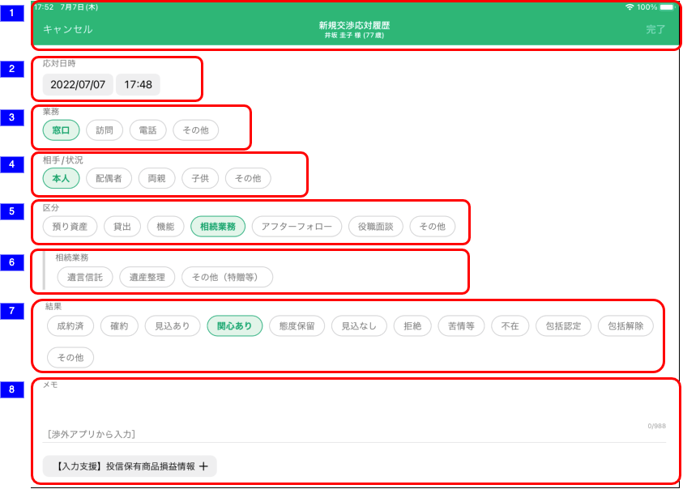

# 交渉応対履歴追加

## 概要

交渉応対履歴を追加するための画面。

## 画面遷移

N/A

## 画面レイアウト図



## 画面項目

1. ヘッダー
    - キャンセルボタン
        - [ ] タップすると、[キャンセルボタンをタップ](#キャンセルボタンをタップ)を実行する
    - 画面名
        - [ ] 「新規交渉応対履歴」を表示する。
    - 顧客情報
        - [ ] 顧客詳細画面にて表示されている対象顧客の氏名と年齢を表示する。
        - [ ] 顧客詳細画面にて年齢が表示されていない場合、年齢（-歳）を表示する。
    - 完了ボタン
        - [ ] 初期表示時点では非活性。以下いずれかの条件を満たす場合にボタンが活性になる。
            - 「業務」が選択されている。
            - 「相手/状況」が選択されている。
            - 「区分」が選択されている。
            - 「結果」が選択されている。
    - [ ] タップすると、[完了ボタンをタップ](#完了ボタンをタップ)を実行する。
2. 応対日時
    - [ ] 初期状態で現在日時が表示される。
    - [ ] 日付のラベルをタップすると日付ピッカーが表示され、当日までの日付を選択できる。翌日以降はグレーアウトされ選択できない。
    - [ ] 時刻のラベルをタップすると時刻ピッカーが表示され、時刻を選択できる。
3. 業務
    - [ ] 「窓口」「訪問」「電話」「その他」が表示され単一項目を選択できる。
4. 相手/状況
    - [ ] 「本人」「配偶者」「両親」「子供」「その他」が表示され単一項目を選択できる。
5. 区分
    - [ ] 「預り資産」「貸出」「機能」「相続業務」「アフターフォロー」「役職面談」「その他」が表示され単一項目を選択できる。
    - [ ] 「預り資産」「貸出」「相続業務」「アフターフォロー」「その他」を選択した場合、「区分内訳」が表示される。
    - [ ] 「機能」「役職面談」を選択した場合、「区分内訳」は表示されない。
6. 区分内訳
    - 区分で「預り資産」を選択した場合
        - ラベルに「預り資産」、選択項目に「円貨」「外貨預金」「投資信託」「ファンドラップ」「公共債」「年金・終身」「保障性保険」「金融仲介」「その他」が表示され、複数項目を選択できる。
        - ラベルに「センシティブ例外取得」、選択項目に「あり」「なし」が表示、初期値として「なし」が選択されており、単一項目を選択できる。
    - 区分で「貸出」を選択した場合
        - ラベルに「センシティブ例外取得」、選択項目に「あり」「なし」が表示、初期値として「なし」が選択されており、単一項目を選択できる。
    - 区分で「相続業務」を選択した場合
        - ラベルに「相続業務」、選択項目に「遺言信託」「遺産整理」「その他（特贈等）」が表示され、複数項目を選択できる。
    - 区分で「アフターフォロー」を選択した場合
        - ラベルに「アフターフォロー」、選択項目に「円貨」「外貨預金」「投資信託」「ファンドラップ」「公共債」「年金・終身」「保障性保険」「金融仲介」「その他」が表示され、複数項目を選択できる。
        - ラベルに「センシティブ例外取得」、選択項目に「あり」「なし」が表示、初期値として「なし」が選択されており、単一項目を選択できる。
    - 区分で「その他」を選択した場合
        - ラベルに「センシティブ例外取得」、選択項目に「あり」「なし」が表示、初期値として「なし」が選択されており、単一項目を選択できる。
7. 結果
    - [ ] 「成約済」「確約」「見込あり」「関心あり」「態度保留」「見込なし」「拒絶」「苦情等」「不在」「包括認定」「包括解除」「その他」が表示され単一項目を選択できる。
8. メモ
    - [ ] 項目をタップした場合、キーボードが出現する。
    - [ ] 入力方法が自由入力である。
    - [ ] ×をタップすると入力内容を削除する。
    - [ ] 入力エリアの下部に`［渉外アプリから入力］`が表示される。このテキストはユーザーが入力したメモの文字列に追加され、交渉応対履歴に記録される。
    - [ ] CRMに登録できない文字（ShiftJISに変換できない文字）が含まれる場合、メモの下部に`CRMに登録できない文字が含まれています。<登録できない文字>` というメッセージが赤字で表示される。CRMに登録できない文字を含む場合でも登録は可能だが、代替文字に変換され交渉応対履歴に記録される。
    - [ ] メモ欄の右下に文字数カウンターが表示される。分母は1000文字から`［渉外アプリから入力］`と改行分を引いた文字数、分子が現在入力中の文字数となる。  
    （絵文字などのCRMに登録できない文字が含まれる場合、渉外アプリ上1文字に見えてもCRM連携時にShiftJIS変換する際に2文字もしくは3文字に変換されるケースがあるため1000文字未満でも入力できなくなる可能性がある。iOSアプリではutf16相当で1000文字以下になるようにチェックする。）
    - [ ] 最大文字数を超えて入力可能だが、その場合入力中の文字と文字数カウンターが赤色となる。
    - [ ] メモの下部に「`【入力支援】投信保有商品損益情報`」ボタンが表示される。
    - [ ] 「`【入力支援】投信保有商品損益情報`」ボタンをタップすると[投信保有商品損益情報を取得](#投信保有商品損益情報を取得)を実行する。

## イベント

この項では、当画面にて実行されるイベント一覧を記述する。

### 完了ボタンをタップ

- [ ] 交渉応対履歴の追加APIを実行する。
- [ ] 登録が成功するとメッセージが「交渉応対履歴を登録しました。」というアラートダイアログが表示される。
- [ ] アラートダイアログの「閉じる」ボタンをタップすると当画面を閉じる。

### キャンセルボタンをタップ

- [ ] 当画面を閉じる。

### 投信保有商品損益情報を取得

- [ ] 投資信託サマリー取得APIと投資信託銘柄一覧APIを実行する。
- [ ] 取得した応答から1,2行目に評価損益額合計を入力する。3行目以降に改行を仕切りとし各銘柄ごとの名称と評価損益額を追加する。銘柄ごとの評価額が0円以上の場合金額の前に`+`を付与する。マイナスの場合は`▲`を付与する。

```text
【投信保有商品損益情報】
評価損益額合計：12,345,678円

アムンディ・りそなワールド・セレクト・ファンド（りそなオールスター）
+123,456円

ニッセイ日本インカムオープン(Ｊボンド)
▲23,456円
```

- [ ] メモ欄に既に文字が入力されている場合、改行と`--------`を仕切り線として評価損益合計額の前に追加する。
- [ ] 投信口座が存在しない場合（APIの応答がE404-008の場合）や投資信託銘柄一覧APIの応答のうち、現保有分の銘柄が存在しない場合はメッセージ「保有している投資信託は存在しません」でアラートダイアログが表示される。
