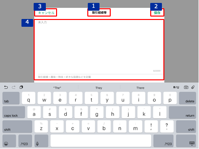

# 取引経緯等追加・編集

## 概要

顧客詳細プロフィールの取引経緯等エリアの[編集ボタン（取引経緯等）のタップイベント](./顧客詳細プロフィール.md#編集ボタン（取引経緯等）をタップ)により表示する。以下の操作ができる。

- 取引経緯等の登録・更新

## 画面遷移

[Figma](https://www.figma.com/file/wwW1SVp7aIw78nTzVOsTmM/-%E3%81%8A%E5%AE%A2%E6%A7%98%E3%83%BB%E9%96%8B%E7%99%BA%E9%80%A3%E6%90%BA-%E6%8F%90%E6%A1%88%E3%82%B5%E3%83%9D%E3%83%BC%E3%83%88%E3%82%B7%E3%82%B9%E3%83%86%E3%83%A0-iOS?node-id=449%3A6485)

## 画面レイアウト図

## 画面項目

取引経緯等追加・編集画面には、以下の情報を上から順に表示する。

1. タイトル
   - [x] "取引経緯等"を表示する。
2. 保存ボタン
   - [x] 追加操作、編集操作ともに初期状態では非活性。
   - [x] 入力内容が変更されると活性化される。
   - [x] タップすると[保存ボタンをタップ](#保存ボタンをタップ)を実行する。
3. キャンセルボタン
   - [x] タップすると[キャンセルボタンをタップ](#キャンセルボタンをタップ)を実行する。
4. テキストエリア
   - 本文
     - [x] 追加操作で表示した場合、placeholderに"未入力"を表示する。
     - [x] 編集操作で表示した場合、登録情報をセットする。登録情報が存在しない場合、placeholderに"未入力"を表示する。
     - [x] 表示された時点でカーソルが本文エリアにフォーカスされており、キーボードが出現する。
     - [x] 入力方法はテキスト入力である。
     - [x] 入力可能文字は2000文字である。
   - 注釈
     - [x] 本文エリアの下に"取引経緯・趣味・特技・好きな話題などを記載"の注釈を表示する。
   - 文字数
     - [x] 本文エリアの右下に現在入力されている文字数を`X/2000`の形式で表示する。
   - 本文削除ボタン
     - [x] 本文エリアにフォーカスすると右下に×ボタンを表示する。
     - [x] 押下すると現在の入力内容を削除し、placeholderに"未入力"を表示する。

## イベント

この項目では、当画面にて実行されるイベント一覧を記述する。  
※当画面（取引経緯等追加・編集）を閉じると顧客詳細プロフィール画面が表示された状態となる。

### 保存ボタンをタップ

- [x] 編集操作でタップした場合、更新処理を行う。
  - [x] 更新内容を反映する。
  - [x] 当画面を閉じ、登録が完了した旨のトーストを表示する。
  - [x] 顧客詳細プロフィール画面の取引経緯等エリアの更新者情報を更新する。
- [x] 追加操作でタップした場合、登録処理を行う。
  - [x] 登録内容を反映する。
  - [x] 当画面を閉じ、登録が完了した旨のトーストを表示する。
  - [x] 顧客詳細プロフィール画面の取引経緯等エリアの更新者情報を更新する。

### キャンセルボタンをタップ

- [x] 編集操作でタップした場合、以下を実行する。
  - [x] 変更がない場合は、当画面を閉じる。
  - [x] 変更がある場合は、確認ダイアログを表示する。
    - [x] 確認ダイアログでキャンセルを選択すると、当画面に戻る。
    - [x] 確認ダイアログで破棄を選択すると、更新内容は反映せずに当画面を閉じる。
- [x] 追加操作でタップした場合、以下を実行する。
  - [x] 入力がない場合は、当画面を閉じる。
  - [x] 入力がある場合は、確認ダイアログを表示する。
    - [x] 確認ダイアログでキャンセルを選択すると、当画面に戻る。
    - [x] 確認ダイアログで破棄を選択すると、登録内容は反映せずに当画面を閉じる。
