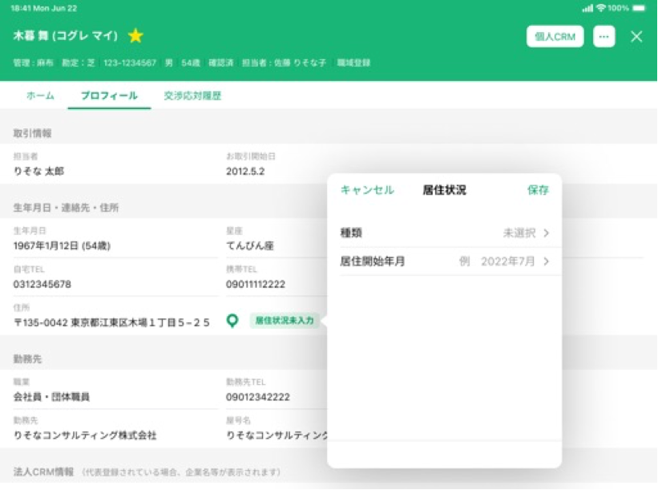
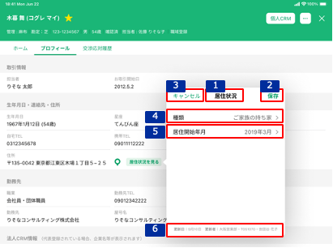
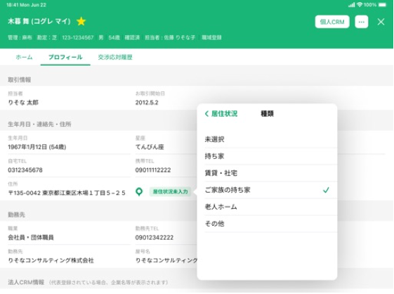
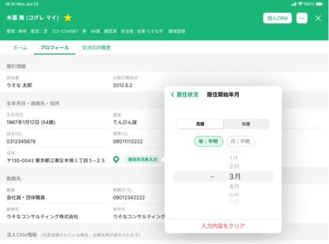
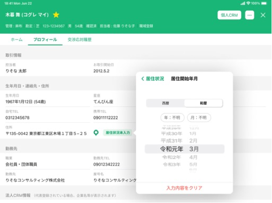

# 居住状況追加・編集

## 概要

居住状況の明細が存在しない場合、顧客詳細プロフィールの生年月日・連絡先・住所エリアの[居住状況ボタン（未入力）のタップイベント](./顧客詳細プロフィール.md#居住状況ボタン（未入力）をタップ)によりポップオーバーを表示する。以下の操作ができる。

- 居住状況の追加

居住状況の明細が存在する場合、顧客詳細プロフィールの生年月日・連絡先・住所エリアの[居住状況ボタン（入力済）のタップイベント](./顧客詳細プロフィール.md#居住状況ボタン（入力済）をタップ)によりポップオーバーを表示する。以下の操作ができる。

- 居住状況の更新

## 画面遷移

[Figma](https://www.figma.com/file/wwW1SVp7aIw78nTzVOsTmM/-%E3%81%8A%E5%AE%A2%E6%A7%98%E3%83%BB%E9%96%8B%E7%99%BA%E9%80%A3%E6%90%BA-%E6%8F%90%E6%A1%88%E3%82%B5%E3%83%9D%E3%83%BC%E3%83%88%E3%82%B7%E3%82%B9%E3%83%86%E3%83%A0-iOS?node-id=449%3A6485)

## 画面レイアウト図

## 画面項目

居住状況追加・編集ポップオーバーには、以下の情報を上から順に表示する。

1. タイトル
   - [x] "居住状況"を表示する。
2. 保存ボタン
   - [x] 追加操作、編集操作ともに初期状態では非活性。
   - [x] 入力内容が変更されると活性化される。
   - [x] タップすると[保存ボタンをタップ](#保存ボタンをタップ)を実行する。
3. キャンセルボタン
   - [x] タップすると[キャンセルボタンをタップ](#キャンセルボタンをタップ)を実行する。
4. 種類
   - [x] 追加操作で表示した場合、placeholderに"未選択"を表示する。
   - [x] 編集操作で表示した場合、登録情報をセットする。登録情報が存在しない場合、placeholderに"未選択"を表示する。
   - [x] 項目をタップすると[項目（種類）をタップ](#項目（種類）をタップ)を実行する。
   - 居住状況種類画面
     - タイトル
       - [x] "種類"を表示する。
     - 居住状況ボタン
       - [x] タップすると[居住状況ボタンをタップ](#居住状況ボタンをタップ)を実行する。
     - 選択肢
       - [x] "未選択/持ち家/賃貸・社宅/ご家族の持ち家/老人ホーム/その他"の選択肢を表示する。
       - [x] 値が入力されている場合、入力されている値が選択された状態で選択肢を表示する。
       - [x] 選択肢をタップすると[選択肢（種類）をタップ](#選択肢（種類）をタップ)を実行する。
5. 居住開始年月
   - [x] 追加操作で表示した場合、placeholderに"例 YYYY年M月"を表示する。（YYYY年M月は当月）
   - [x] 編集操作で表示した場合、登録情報をセットする。登録情報が存在しない場合、placeholderに"例 YYYY年M月"を表示する。（YYYY年M月は当月）
     - [x] 年月が明瞭な場合は"YYYY年M月"が表示される。
     - [x] 年が不明な場合は"----年M月"が表示される。
     - [x] 月が不明な場合は"YYYY年--月"が表示される。
     - [x] 年月が不明な場合は登録情報が存在しない状態となるため、placeholderが表示される。
   - [x] 項目をタップすると[項目（居住開始年月）をタップ](#項目（居住開始年月）をタップ)を実行する。
   - 居住開始年月画面
     - タイトル
       - [x] "居住開始年月"を表示する。
     - 居住状況ボタン
       - [x] タップすると[居住状況ボタンをタップ](#居住状況ボタンをタップ)を実行する。
     - 西暦・和暦タブ
       - [x] タップすると[タブ（西暦・和暦）をタップ](#タブ（西暦・和暦）をタップ)を実行する。
     - 年月入力
       - [x] 年、月についてそれぞれ不明ボタンがあり、不明ボタンをタップするとドラムロールに"--"を表示する。
       - [x] ドラムロールにて年、月が入力可能である。
       - [x] 値が入力されている場合、入力されている値が選択された状態で表示する。
       - [x] 値が入力されていない場合、ドラムロールのYYYY年M月は当月に合わせる。
       - [x] [タブ（西暦・和暦）をタップ](#タブ（西暦・和暦）をタップ)のイベントで和暦入力に変更した場合、正しい和暦が選択された状態で表示する。
         - 年が「2019年」、月が不明を選択して和暦入力に変更した場合、「平成31年--月」を表示する。（不明の場合は01月で補完される）
         - 年が「1989年」、月が「1月」を選択して和暦入力に変更した場合、「昭和64年1月」を表示する。（日は1日で補完される）
     - 入力内容をクリア
       - [x] タップすると入力されていた内容が消え、ドラムロールのYYYY年M月は当月に合わせる。
       - [x] タップすると登録情報が存在しない状態になるため、居住状況追加画面や居住状況編集画面の居住開始年月のplaceholderに"例 YYYY年M月"を表示する。（YYYY年M月は当月）
6. 更新者情報
   - [x] 明細が存在しない場合、何も表示しない。
   - [x] 明細が存在する場合、更新日、更新者を表示する。
   - 更新日
     - [x] 居住状況の明細のうち、最終更新日時が最も新しい明細の最終更新年月日を`YYYY.M.D`の形式で表示する。
   - 更新者
     - [x] 居住状況の明細のうち、最終更新日時が最も新しい明細の更新者情報を`支店名・R2ID・更新者名`の形式で表示する。
     - [x] 更新者が退職済みの場合、所属店名、R2ID、更新者氏名を表示する。
     - [x] 所属店名が不明な場合、"不明な支店"を表示する。

## イベント

この項目では、当画面にて実行されるイベント一覧を記述する。  
※当画面（居住状況追加、居住状況編集）を閉じると顧客詳細プロフィール画面が表示された状態となる。

### 保存ボタンをタップ

- [x] 編集操作でタップした場合、更新処理を行う。
  - [x] 更新内容を反映する。
  - [x] 当画面を閉じ、登録が完了した旨のトーストを表示する。
  - [x] 居住状況編集画面の更新者情報を更新する。
- [x] 追加操作でタップした場合、登録処理を行う。
  - [x] 登録内容を反映する。
  - [x] 当画面を閉じ、登録が完了した旨のトーストを表示する。
  - [x] 顧客詳細プロフィール画面の居住状況ボタン名を"居住状況未入力"から"居住状況を見る"に変更する。
  - [x] 居住状況編集画面の更新者情報を更新する。

### キャンセルボタンをタップ

- [x] 編集操作でタップした場合、以下を実行する。
  - [x] 変更がない場合は、当画面を閉じる。
  - [x] 変更がある場合は、確認ダイアログを表示する。
    - [x] 確認ダイアログでキャンセルを選択すると、当画面に戻る。
    - [x] 確認ダイアログで破棄を選択すると、更新内容は反映せずに当画面を閉じる。
- [x] 追加操作でタップした場合、以下を実行する。
  - [x] 入力がない場合は、当画面を閉じる。
  - [x] 入力がある場合は、確認ダイアログを表示する。
    - [x] 確認ダイアログでキャンセルを選択すると、当画面に戻る。
    - [x] 確認ダイアログで破棄を選択すると、登録内容は反映せずに当画面を閉じる。

### 項目（種類）をタップ

- [x] 居住状況種類画面に遷移する。

### 項目（居住開始年月）をタップ

- [x] 居住開始年月（西暦）画面に遷移する。

### 居住状況ボタンをタップ

- [x] 追加操作の場合、居住状況追加画面に遷移する。
- [x] 編集操作の場合、居住状況編集画面に遷移する。

### 選択肢（種類）をタップ

- [x] 選択情報をセットして居住状況追加画面、居住状況編集画面、居住状況種類画面に反映する。
- [x] 追加操作の場合、居住状況追加画面に遷移する。
- [x] 編集操作の場合、居住状況編集画面に遷移する。

### タブ（西暦・和暦）をタップ

- [x] 居住開始年月（西暦）を表示している場合、"和暦"タブをタップすると居住開始年月（和暦）に遷移する。"西暦"タブをタップしても何も実行しない。
- [x] 居住開始年月（和暦）を表示している場合、"西暦"タブをタップすると居住開始年月（西暦）に遷移する。"和暦"タブをタップしても何も実行しない。
