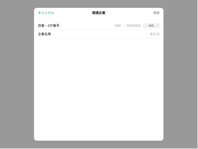

# 関連企業追加・編集

## 概要

顧客詳細プロフィールの関連企業エリアの[追加ボタン（関連企業エリア）のタップイベント](./顧客詳細プロフィール.md#追加ボタン（関連企業エリア）をタップ)により画面を表示する。以下の操作ができる。

- 関連企業の追加

顧客詳細プロフィールの関連企業エリアの[明細（関連企業エリア）のタップイベント](./顧客詳細プロフィール.md#明細（関連企業エリア）をタップ)により画面を表示する。以下の操作ができる。

- 関連企業の更新・削除

## 画面遷移

[Figma](https://www.figma.com/file/wwW1SVp7aIw78nTzVOsTmM/-%E3%81%8A%E5%AE%A2%E6%A7%98%E3%83%BB%E9%96%8B%E7%99%BA%E9%80%A3%E6%90%BA-%E6%8F%90%E6%A1%88%E3%82%B5%E3%83%9D%E3%83%BC%E3%83%88%E3%82%B7%E3%82%B9%E3%83%86%E3%83%A0-iOS?node-id=449%3A6485)

## 画面レイアウト図

## 画面項目

関連企業追加画面、関連企業編集画面には、以下の情報を上から順に表示する。

1. タイトル
   - [x] "関連企業"を表示する。
2. 保存ボタン
   - [x] 追加操作、編集操作ともに初期状態では非活性。
   - [x] 入力内容が変更されると活性化される。
   - [x] タップすると[保存ボタンをタップ](#保存ボタンをタップ)を実行する。
3. キャンセルボタン
   - [x] タップすると[キャンセルボタンをタップ](#キャンセルボタンをタップ)を実行する。
4. 店番・CIF番号
   - 数値入力
     - [x] 追加操作で表示した場合、placeholderに"000-0000000"を表示する。
     - [x] 編集操作で表示した場合、登録情報をセットする。登録情報が存在しない場合、placeholderに"000-0000000"を表示する。
     - [x] 入力方法は数字の自由入力である。
       - [x] 入力可能文字数は店番が3桁、CIF番号が7桁である。
       - [x] 店番を3桁入力すると自動でフォーカスがCIF番号の入力フィールドに移動する。
       - [x] CIF番号が入力されている状態から削除して0桁にすると自動でフォーカスが店番の入力フィールドに移動する。
       - [x] 店番、CIF番号がそれぞれ3桁、7桁に満たずにフォーカスを外す、もしくはEnterをタップすると頭0埋めで整形される。
   - 検索ボタン
     - [x] 登録情報が存在しない場合、"検索"ボタンは非活性で表示し、タップしても反応しない。
     - [x] 店番とCIF番号それぞれ1桁以上入力されると"検索"ボタンは活性化する。
     - [x] 活性化された"検索"ボタンをタップすると[顧客検索](#顧客検索)を実行する。
     - [x] 店番とCIF番号それぞれ1桁以上入力された状態でフォーカスを外す、もしくはEnterをタップすると[顧客検索](#顧客検索)を実行する。
     - [x] 店番3桁、CIF番号7桁が入力されると[顧客検索](#顧客検索)を実行する。
5. 企業名等
   - [x] 追加操作で表示した場合、placeholderに"未入力"を表示する。
   - [x] 編集操作で表示した場合、登録情報をセットする。登録情報が存在しない場合、placeholderに"未入力"を表示する。
   - [x] 入力方法はテキスト入力である。
   - [x] 入力可能文字は全角50文字である。1行で表示できない場合は改行する。
6. 関連企業を削除ボタン
   - [x] 編集操作で表示した場合、画面下部に表示される。
   - [x] タップすると[関連企業を削除ボタンをタップ](#関連企業を削除ボタンをタップ)を実行する。

## イベント

この項目では、当画面にて実行されるイベント一覧を記述する。  
※当画面（関連企業追加、関連企業編集）を閉じると顧客詳細プロフィール画面が表示された状態となる。

### 顧客検索

- [x] ユーザーの所属銀行の銀行識別子と入力された店番・CIF番号から顧客一覧取得APIを実行する。
- [x] 顧客情報の読み込み中は検索ボタンのラベルが「検索中」に変わり、ボタン内にローディングアイコンが表示される。また、読み込み中にボタンをタップしても反応しない。
- 顧客一覧取得APIから顧客情報が取得できた場合
  - [x] 関連企業自動入力のポップオーバーを表示して該当企業の情報を表示する。
  - [x] "企業名等を引用する"ボタンをタップすると、`企業名等`が関連企業の企業名等に反映される。
  - [x]  "閉じる"ボタンをタップすると、反映せずにポップオーバーが閉じる。
- 顧客一覧取得APIから顧客情報が取得できなかった場合
  - [x] 検索ボタンのラベルが「該当なし」に変わり、背景がグレーアウトされ非活性となる。

### 保存ボタンをタップ

店番・CIF番号と企業名等の整合性チェックは行わない。

- [x] 編集操作でタップした場合、更新処理を行う。
  - [x] 更新内容を反映する。
  - [x] 顧客詳細プロフィール画面の関連企業エリアは追加した順で明細を表示する仕様のため、更新された明細の表示順序に変更はない。
  - [x] 当画面を閉じ、登録が完了した旨のトーストを表示する。
  - [x] 顧客詳細プロフィール画面の関連企業エリアの更新者情報を更新する。
- [x] 追加操作でタップした場合、登録処理を行う。
  - [x] 登録内容を反映する。
  - [x] 顧客詳細プロフィール画面の関連企業エリアは追加した順で明細を表示する仕様のため、追加された明細は最終行に表示される。
  - [x] 当画面を閉じ、登録が完了した旨のトーストを表示する。
  - [x] 顧客詳細プロフィール画面の関連企業エリアの更新者情報を更新する。

### キャンセルボタンをタップ

- [x] 編集操作でタップした場合、以下を実行する。
  - [x] 変更がない場合は、当画面を閉じる。
  - [x] 変更がある場合は、確認ダイアログを表示する。
    - [x] 確認ダイアログでキャンセルを選択すると、当画面に戻る。
    - [x] 確認ダイアログで破棄を選択すると、更新内容は反映せずに当画面を閉じる。
- [x] 追加操作でタップした場合、以下を実行する。
  - [x] 入力がない場合は、当画面を閉じる。
  - [x] 入力がある場合は、確認ダイアログを表示する。
    - [x] 確認ダイアログでキャンセルを選択すると、当画面に戻る。
    - [x] 確認ダイアログで破棄を選択すると、登録内容は反映せずに当画面を閉じる。

### 関連企業を削除ボタンをタップ

- [x] タップした場合、削除の確認ダイアログを表示する。
  - [x] 確認ダイアログでキャンセルを選択すると、削除処理を実行せずに確認ダイアログを閉じ、当画面に戻る。
  - [x] 確認ダイアログで削除を選択すると、削除処理を実行する。
    - [x] 該当明細を削除し、顧客詳細プロフィール画面の関連企業エリアに反映する。
    - [x] 顧客詳細プロフィール画面の関連企業エリアの更新者情報を更新する。（削除した明細を除いて一番新しい明細の更新者情報が表示される。）
