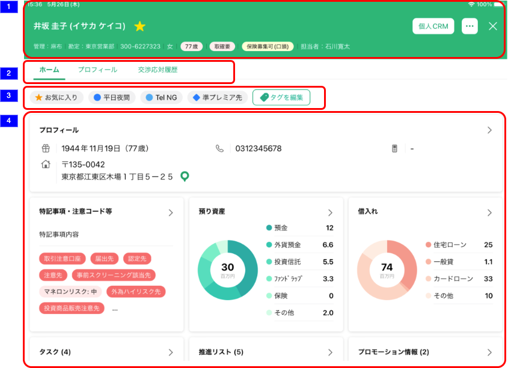
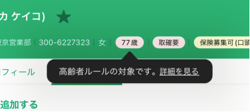
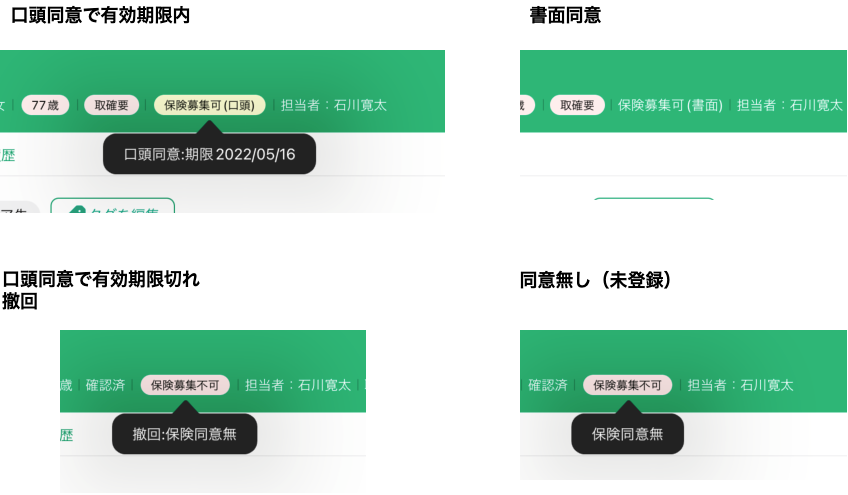

# 顧客詳細（個人顧客）

## 概要

顧客の詳細を確認するための画面。

## 画面遷移

N/A

## 画面レイアウト図

- 顧客詳細トップ（ヘッダー）

## 画面項目

1. ヘッダー
    - 顧客氏名
        - [x] 対象顧客の氏名がカナも含めて表示される。
        - [x] 対象顧客の氏名が存在しない場合"不明(-)"と表示される。
    - お気に入りタグボタン
        - [x] お気に入りタグがついていない状態でタップすると、対象顧客にお気に入りタグが付いて、黄色く表示される。
        - [x] お気に入りタグが付いている状態でタップすると、対象顧客からお気に入りタグが消えて、深い緑色に表示される。
    - タブレットCRMリンク
        - [x] タップすると[タブレットCRM画面の表示](#タブレットCRM画面の表示)を実行する。
    - メニューボタン
        - [x] タップすると[メニューボタンをタップ](#メニューボタンをタップ)を実行する。
    - 閉じるボタン
        - [x] タップすると[閉じるボタンをタップ](#閉じるボタンをタップ)を実行する。
    - 顧客情報詳細エリア
        - [x] 管理店
            - [x] 対象顧客の管理店名が"管理:〇〇"と表示される。
        - [x] 勘定店
            - [x] 対象顧客の勘定店名が"勘定:〇〇"と表示される。
        - [x] 店CIF
            - [x] 対象顧客の店CIFが表示される。
        - [x] 性別
            - [x] 存在しない場合、"-"で表示される。
            - [x] "男性", "女性", "その他"のうち該当するものが表示される。
        - [x] 年齢
            - [x] 存在しない場合、"-歳"と表示される。
            - [x] 生年月日から計算された年齢が"〇歳"と表示される。
            - 年齢が75歳以上の場合

              
              - [x] 年齢のラベルがピンク色の背景で強調表示される。
              - [x] ラベルをタップするとポップオーバーが表示される。
              - [x] ポップオーバー内の `詳細を見る` をタップすると[アットりそな高齢者ルール画面の表示](#アットりそな高齢者ルール画面の表示)を実行する。
        - [x] マネロン本人確認
            - [x] 存在しない場合、"-"で表示される。
            - [x] "取確要", "確認済", "厳菅先", "厳菅国", "未確認"のうち該当するものが表示される。
        - [x] 保険同意状況

            
            - 口頭同意で有効期限内の場合
              - [x] 背景が薄い黄色のラベルに「保険募集可(口頭)」と表示される。
              - [x] ラベルをタップすると「口頭同意：期限YYYY/MM/DD」というメッセージのポップオーバーが表示される。
            - 口頭同意で有効期限切れの場合
              - [x] 背景が薄いピンクのラベルに「保険募集不可」と表示される。
              - [x] ラベルをタップすると「撤回:保険同意無」というメッセージのポップオーバーが表示される。
            - 撤回の場合
              - [x] 背景が薄いピンクのラベルに「保険募集不可」と表示される。
              - [x] ラベルをタップすると「撤回:保険同意無」というメッセージのポップオーバーが表示される。
            - 書面同意の場合
              - [x] ラベルの背景は無しで白文字で「保険募集可(書面)」と表示される。
            - 同意無し（未登録）の場合
              - [x] 背景が薄いピンクのラベルに「保険募集不可」と表示される。
              - [x] ラベルをタップすると「保険同意無」というメッセージのポップオーバーが表示される。
        - [x] 担当者
            - [x] 存在しない場合、"担当者:-"と表示される。
            - [x] 対象顧客の担当者氏名が表示される。
        - [x] 地域情報登録フラグ
            - [x] "担当者登録"、"区分なし"の場合、何も表示されない
            - [x] "職域登録"の場合、"職域登録"が表示される。
            - [x] "地域登録"の場合、"地域登録"が表示される。
2. 表示切り替えタブ
   - ホームタブ
     - [x] タップしても何も実行しない。
   - プロフィールタブ
     - [x] タップすると[プロフィールタブをタップ](#プロフィールタブをタップ)を実行する。
   - 交渉応対履歴タブ
     - [x] タップすると[交渉応対履歴タブをタップ](#交渉応対履歴タブをタップ)を実行する。
3. タグ
4. カード表示エリア

## イベント

### タブレットCRM画面の表示

- [x] タブレットCRM（他システム）を全画面モーダル表示する。

### アットりそな高齢者ルール画面の表示

- [x] アットりそな高齢者ルールページを全画面モーダル表示する。

### メニューボタンをタップ

- 顧客詳細のメニューとして以下の項目が表示される。

  

  - 相続税簡易シミュレーション
    - [x] 相続税簡易シミュレーション画面に遷移する。
  - 名字Search
    - [x] 氏名が"不明"の場合、遷移しない。
    - [x] 対象顧客の名字をクエリにセットして"https://myoji-yurai.net/"に遷移する。
  - 誕生日Wiki
    - [x] 誕生日が存在しない場合、遷移しない。
    - [x] 対象顧客の誕生日をクエリにセットして"https://ja.wikipedia.org"に遷移する。

### 閉じるボタンをタップ

- [x] 顧客詳細画面を閉じて、顧客詳細画面に遷移する前に表示していた画面を表示する。

### プロフィールタブをタップ

- [x] [顧客詳細プロフィール画面](./顧客詳細プロフィール)に遷移する。

### 交渉応対履歴タブをタップ

- [x] [顧客詳細交渉応対履歴一覧画面](./顧客詳細交渉応対履歴一覧)に遷移する。

### 地図アイコンをタップ

- [x] 「住所を地図上で表示しますか？」というメッセージの確認ダイアログを表示する。
- [x] 「キャンセル」をタップした場合、ダイアログを閉じる。
- [x] 「表示する」をタップした場合、顧客詳細画面を閉じ、地図画面に遷移したのち地図上で該当顧客を表示する。
