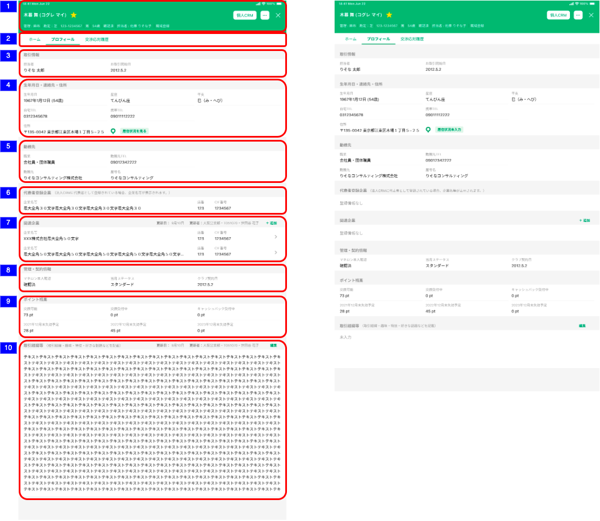

# 顧客詳細プロフィール

## 概要

個人顧客の属性情報を確認するための画面。

## 画面遷移

[Figma](https://www.figma.com/file/wwW1SVp7aIw78nTzVOsTmM/-%E3%81%8A%E5%AE%A2%E6%A7%98%E3%83%BB%E9%96%8B%E7%99%BA%E9%80%A3%E6%90%BA-%E6%8F%90%E6%A1%88%E3%82%B5%E3%83%9D%E3%83%BC%E3%83%88%E3%82%B7%E3%82%B9%E3%83%86%E3%83%A0-iOS?node-id=449%3A6485)

## 画面レイアウト図

- 顧客詳細プロフィール



## 画面項目

1. ヘッダー
   - [顧客詳細トップ（個人顧客）](./顧客詳細トップ（個人顧客）.md#画面項目)参照
2. 表示切替タブ
   - ホームタブ
     - [x] タップすると[ホームタブをタップ](#ホームタブをタップ)を実行する。
   - プロフィールタブ
     - [x] タップしても何も実行しない。
   - 交渉応対履歴タブ
     - [x] タップすると[交渉応対履歴タブをタップ](#交渉応対履歴タブをタップ)を実行する。
3. 取引情報エリア
    - 担当者
      - [x] 担当者の氏名を表示する。
    - お取引開始日
      - [x] 取引開始日を`YYYY/M/D`形式で表示する。
4. 生年月日・連絡先・住所エリア
    - ヘッダー
      - エリア名
          - [x] "生年月日・連絡先・住所"を表示する。
    - コンテンツ
      - 生年月日
          - [x] 生年月日と年齢を`YYYY年M月D日（XX歳）`形式で表示する。
      - 星座
          - [x] 星座を表示する。
      - 干支
          - [x] 干支を表示する。
      - 自宅TEL
          - [x] 自宅電話番号を表示する。
      - 携帯TEL
          - [x] 携帯電話番号を表示する。
      - 住所
          - [x] 住所を表示する。
      - 地図アイコン
          - [x] タップ時のイベントは[顧客詳細トップ画面](./顧客詳細トップ（個人顧客）)参照。
      - 居住状況
          - [x] 居住状況ボタンを表示する。
          - [x] 明細が存在しない、あるいは種類と居住開始年月が選択されていない場合、"居住状況未入力"を表示する。
          - [x] 明細が存在する場合、"居住状況を見る"を表示する。
          - [x] 居住状況ボタンをタップするとポップオーバーを表示する。
          - [x] "居住状況を見る"をタップすると[居住状況ボタン（入力済）をタップ](#居住状況ボタン（入力済）をタップ)を実行する。
          - [x] "居住状況未入力"をタップすると[居住状況ボタン（未入力）をタップ](#居住状況ボタン（未入力）をタップ)を実行する。
5. 勤務先エリア
    - ヘッダー
      - エリア名
          - [x] "勤務先"を表示する。
    - コンテンツ
      - 職業
          - [x] 職業を表示する。
      - 勤務先TEL
          - [x] 勤務先電話番号を表示する。
      - 勤務先
          - [x] 勤務先を表示する。
      - 屋号名
          - [x] 屋号名を表示する。
6. 法人CRM情報エリア
    - ヘッダー
      - エリア名
          - [x] "代表者登録企業（法人CRMに代表者として登録されている場合、企業名等が表示されます。）"を表示する。
    - コンテンツ
        - [x] 法人CRMに代表登録されている企業がない場合、"登録情報なし"を表示する。
        - [x] 法人CRMに代表登録されている企業がある場合、企業名等、店番、CIF番号を表示する。
        - [x] 法人CRMに代表登録されている企業がある場合、明細は店番、CIF番号の昇順でソートされていること。<br>
          <span style="color: green;">ソート順についてはCRMの設計書参照</span>
        - 企業名等
          - [x] 該当企業がない場合、ブランクで表示する。
          - [x] 該当企業がある場合、登録されている企業名等を表示する。
          - [x] 表示領域を超える文字数が登録されている場合、三点リードを表示する。
        - 店番
          - [x] 該当企業がない場合、ブランクで表示する。
          - [x] 該当企業がある場合、登録されている店番を表示する。
        - CIF番号
          - [x] 該当企業がない場合、ブランクで表示する。
          - [x] 該当企業がある場合、登録されているCIF番号を表示する。
7. 関連企業エリア
    - ヘッダー
      - エリア名
          - [x] "関連企業"を表示する。
      - 更新情報
          - [x] 明細が存在しない場合、何も表示しない。
          - [x] 明細が存在する場合、更新日、更新者を表示する。<br>
            <span style="color: green;">更新者情報は資産負債情報明細一覧（預金・投資商品）より引用。変更が無いか、要確認。</span>

          - 更新日
            - [x] 関連企業の明細のうち、最終更新日時が最も新しい明細の最終更新年月日を`YYYY.M.D`の形式で表示する。

                   ```
                       ・更新日時が最も新しい明細を削除した場合、次に新しい日付が表示されることになる。
                       ・明細を全て削除した場合、明細が存在しない状態になり、何も表示されない。
                       例: 1明細のみ登録されたデータを削除した場合、
                       ①何も登録していない状態         →更新日には何も表示しない
                       ①1/31　1明細を登録             →"更新日：1月31日を表示
                       ②2/1　 ①で登録した1明細を削除   →更新日には何も表示しない
                   ```

          - 更新者
            - [x] 関連企業の明細のうち、最終更新日時が最も新しい明細の更新者情報を`支店名・R2ID・更新者名`の形式で表示する。
            - [x] 更新者が退職済みの場合、所属店名、R2ID、更新者氏名を表示する。
            - [x] 所属店名が不明な場合、"不明な支店"を表示する。
      - 追加ボタン
          - [x] "＋追加"ボタンを表示する。
          - [x] "＋追加"をタップすると[追加ボタン（関連企業エリア）をタップ](#追加ボタン（関連企業エリア）をタップ)を実行する。
    - コンテンツ
      - [x] 明細が存在しない場合、"登録情報なし"を表示する。
      - [x] 明細が存在する場合、企業名等、店番、CIF番号を表示する。
      - [x] 明細が存在する場合、明細が追加された順（明細ID)の昇順でソートされていること。
      - [x] 明細をタップすると[明細（関連企業エリア）をタップ](#明細（関連企業エリア）をタップ)を実行する。
      - 企業名等
          - [x] 存在しない場合、ブランクで表示する。
          - [x] 存在する場合、登録されている企業名等を表示する。
      - 店番
          - [x] 存在しない場合、ブランクで表示する。
          - [x] 存在する場合、登録されている店番を表示する。
      - CIF番号
          - [x] 存在しない場合、ブランクで表示する。
          - [x] 存在する場合、登録されているCIF番号を表示する。
8. 管理・契約情報エリア
    - ヘッダー
    - コンテンツ
       - マネロン本人確認
       - 当月ステータス
       - クラブ契約日
9. ポイント残高エリア
    - ヘッダー
    - コンテンツ
       - 交換可能
       - 交換受付中
       - キャッシュバック受付中
       - YYYY年MM月末失効予定
       - YYYY年MM月末失効予定
       - YYYY年MM月末失効予定
10. 取引経緯等エリア
    - ヘッダー
      - エリア名
          - [x] "取引経緯等（取引経緯・趣味・特技・好きな話題などを記載）"を表示する。
      - 更新情報
          - [ ] 明細が存在しない、あるいはブランクで登録されている場合、何も表示しない。
          - [ ] 明細が存在し、ブランクでない場合、更新日、更新者を表示する。
          - 更新日
            - [x] 取引経緯等の明細のうち、最終更新日時が最も新しい明細の最終更新年月日を`YYYY.M.D`の形式で表示する。
          - 更新者
            - [x] 取引経緯等の更新日、更新者が存在する場合、更新者情報を`支店名・R2ID・更新者名`の形式で表示する。
            - [x] 更新者が退職済みの場合、所属店名、R2ID、更新者氏名を表示する。
            - [x] 所属店名が不明な場合、"不明な支店"を表示する。
      - 編集ボタン
          - [x] "編集"ボタンを表示する。
          - [x] "編集"をタップすると[編集ボタン（取引経緯等）をタップ](#編集ボタン（取引経緯等）をタップ)を実行する。
    - コンテンツ
      - [ ] 明細が存在しない、あるいはブランクで登録されている場合、"未入力"を表示する。
      - [ ] 明細が存在する場合、登録されたテキストを全文表示する。

## イベント

この項目では、当画面にて実行されるイベント一覧を記述する。

> ヘッダーのイベントは、[顧客詳細トップ画面](./顧客詳細トップ（個人顧客）)参照。

### ホームタブをタップ

- [x] [顧客詳細トップ画面](./顧客詳細トップ（個人顧客）)に遷移する。

### 交渉応対履歴タブをタップ

- [x] [顧客詳細交渉応対履歴一覧画面](./顧客詳細交渉応対履歴一覧)に遷移する。

### 居住状況ボタン（未入力）をタップ

- [x] 居住状況追加画面のポップオーバーを表示する。

### 居住状況ボタン（入力済）をタップ

- [x] 居住状況編集画面のポップオーバーを表示する。

### 追加ボタン（関連企業エリア）をタップ

- [x] 関連企業追加画面を表示する。

### 明細（関連企業エリア）をタップ

- [x] 関連企業編集画面を表示する。

### 編集ボタン（取引経緯等）をタップ

- [x] 取引経緯等追加・編集画面を表示する。
