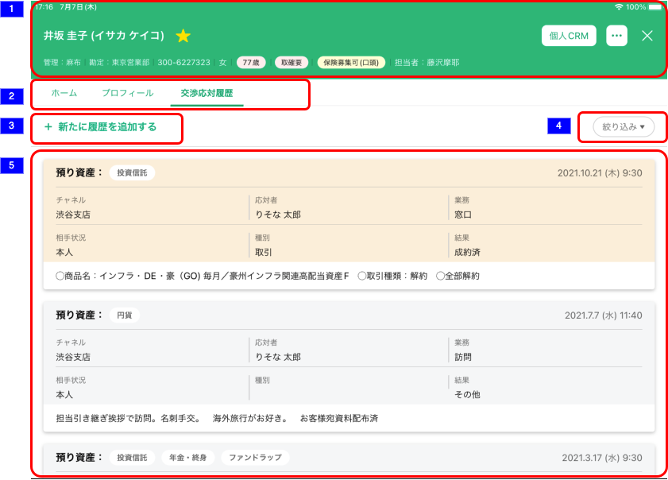

# 顧客詳細交渉応対履歴一覧

## 概要

交渉応対履歴一覧を確認するための画面。

## 画面遷移

N/A

## 画面レイアウト図

- 顧客詳細交渉応対履歴一覧

## 画面項目

1. ヘッダー
    - [顧客詳細トップ（個人顧客）](./顧客詳細トップ（個人顧客）.md)参照
2. 表示切り替えタブ
   - ホームタブ
     - [ ] タップすると[ホームタブをタップ](#ホームタブをタップ)を実行する。
   - プロフィールタブ
     - [ ] タップすると[プロフィールタブをタップ](#プロフィールタブをタップ)を実行する。
   - 交渉応対履歴タブ
     - [ ] タップしても何も実行しない。
3. 新たに履歴を追加するボタン
   - [ ] タップすると[交渉応対履歴追加画面の表示](#交渉応対履歴追加画面の表示)を実行する。
4. 絞り込みボタン
   - [ ] タップすると[交渉応対履歴絞り込み条件画面の表示](#交渉応対履歴絞り込み条件画面の表示)を実行する。
5. 交渉応対履歴一覧表示エリア
   - TODO

## イベント

### ホームタブをタップ

- [ ] [顧客詳細トップ画面](./顧客詳細トップ（個人顧客）.md)に遷移する。

### プロフィールタブをタップ

- [ ] [顧客詳細プロフィール画面](./顧客詳細プロフィール)に遷移する。

### 交渉応対履歴追加画面の表示

- [ ] [交渉応対履歴追加画面](./交渉応対履歴追加.md)を全画面モーダル表示する。

### 交渉応対履歴絞り込み条件画面の表示

- [ ] [交渉応対履歴絞り込み条件画面](./交渉応対履歴絞り込み条件.md)を全画面モーダル表示する。

### 交渉応対履歴詳細画面の表示

- [ ] [交渉応対履歴詳細画面](./交渉応対履歴詳細.md)に遷移する。
